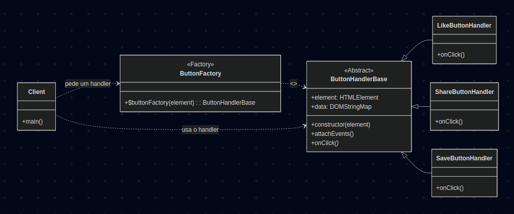

# 3.1.1. Factory Method

## Introdução

O Factory Method é um padrão criacional de projeto que fornece uma interface para criar objetos em uma superclasse, mas permite que as subclasses alterem o tipo de objetos que serão criados. O padrão Factory Method sugere que você substitua chamadas diretas de construção de objetos (usando o operador new) por chamadas para um método fábrica especial. 

## Vantagens

O uso do factory method oferece diversos benefícios, incluindo:

- Evita acoplamentos firmes entre o criador e os produtos concretos;
- Pode-se mover o código de criação do produto para um único local do programa, facilitando a manutenção do código;
- POde-se introduzir novos tipos de produtos no programa sem quebrar o código cliente existente.

## Desvantagens

Apesar de suas vantagens, o código do factory method pode se tornar mais complicado, pois você precisa introduzir muitas subclasses novas para implementar o padrão. O melhor cenário é quando você está introduzindo o padrão em uma hierarquia existente de classes criadoras.


## Metodologia

Para a realização deste projeto, adotamos uma abordagem estruturada, utilizando um conjunto de ferramentas e tecnologias para o desenvolvimento. Abaixo estão listadas as ferramentas empregadas e suas respectivas finalidades:

- **Mermaid**: Utilizado para a criação dos diagramas que ilustram a estrutura do padrão, facilitando a visualização das relações entre classes e interfaces.
- **Visual Studio Code (VSCode)**: Empregado como ambiente de desenvolvimento integrado (IDE) para a escrita, edição e depuração do código-fonte.
- **YouTube**: Utilizado para gravar e compartilhar vídeos demonstrando o funcionamento do código implementado, permitindo a validação visual dos resultados.
- **Docsify**: Ferramenta usada para o desenvolvimento e geração da documentação do projeto, garantindo uma apresentação clara e acessível do conteúdo.
- **Django**: Framework principal utilizado para o desenvolvimento, estruturando o projeto;
- **Python**: Linguagem de programação adotada.

O desenvolvimento seguiu uma abordagem iterativa, iniciando com o estudo do padrão por meio das referências bibliográficas. Essas fontes foram fundamentais para compreender os conceitos teóricos do padrão, suas aplicações práticas e de implementação, orientando a elaboração dos diagramas e a implementação do código. A documentação foi desenvolvida em conjunto e os resultados foram validados por meio de gravações no YouTube.

# Implementações

## 1 - ButtonHandler

A primeira implementação feita foi do Factory Method no front-end da aplicação, com o ButtonHandler para delegar a subclasses a lógica de "curtir", "compartilhar" ou "salvar na biblioteca". 

<font size="2"><p style="text-align: center"><b>Figura 1:</b> Diagrama ButtonHandler</div>

<div style="text-align: center;">



</div>

<font size="2"><p style="text-align: center"><b>Autores:</b> Renan Vieira e Sophia Silva, 2025</p></font>


### Código

Foram implementados os códigos no padrão factory. Seguem abaixo:

```javascript

class ButtonHandlerBase {
  constructor(element) {
    this.element = element; 
    this.data = element.dataset; 
  }

  attachEvents() {
    this.element.addEventListener('click', () => {
      this.onClick();
    });
  }
  onClick() {
    console.warn(`Ação não definida para o botão: ${this.data.action}`);
  }
}

class LikeButtonHandler extends ButtonHandlerBase {
  onClick() {
    this.element.classList.toggle('liked');
    const svg = this.element.querySelector('svg');
    svg.style.fill = 'none';
    const isLiked = this.element.classList.contains('liked');
    if (isLiked) {
      alert(`Você CURTIU o livro ID: ${this.data.bookId}`);
    } else {
      alert(`Você DESCURTIU o livro ID: ${this.data.bookId}`);
    }
  }
}

class ShareButtonHandler extends ButtonHandlerBase {
  onClick() {
    const title = this.data.bookTitle;
    const author = this.data.bookAuthor;
    const url = window.location.href;
    const shareText = `Confira este livro incrível: "${title}" de ${author}. Veja mais em: ${url}`;
    if (navigator.share) {
      navigator.share({
        title: `Biblioteca: ${title}`,
        text: shareText,
        url: url,
      }).catch(err => console.error("Erro ao compartilhar:", err));
    } else {
      prompt('Copie o link para compartilhar:', shareText);
    }
  }
}

class SaveButtonHandler extends ButtonHandlerBase {
    onClick() {
      this.element.classList.toggle('saved');
      const svg = this.element.querySelector('svg');
      svg.style.fill = 'none';
      const isSaved = this.element.classList.contains('saved');
      if (isSaved) {
        alert(`Você SALVOU o livro ID: ${this.data.bookId}`);
      } else {
        alert(`Você REMOVEU o livro ID: ${this.data.bookId}`);
      }
    }
}

function buttonFactory(element) {
  const action = element.dataset.action;

  switch (action) {
    case 'like':
      return new LikeButtonHandler(element);
    case 'share':
      return new ShareButtonHandler(element);
    case 'save':
      return new SaveButtonHandler(element);
    default:
      return new ButtonHandlerBase(element);
  }
}

document.addEventListener('DOMContentLoaded', () => {
  const allButtons = document.querySelectorAll('.action-btn');
  allButtons.forEach(buttonElement => {
    const handler = buttonFactory(buttonElement);
    handler.attachEvents();
  });
});
```

<font size="2"><p style="text-align: center"><b>Autor/es:</b> Sophia Silva e Renan Vieira, 2025</p></font>


### Passo a Passo para Rodar os Códigos

Antes de tudo, certifique-se e ter o python3 e django admin instalado no seu computador.

1. Acesse a branch [Factory - ButtonHandler - Sophia e Renan](https://github.com/UnBArqDsw2025-2-Turma01/2025.2-T01-G5_EuRecomendo_Entrega_03/tree/feat-criacional-factory-sophia-renan) e faça download ou digite no terminal
```
git checkout feat-criacional-factory-sophia-renan
```
2. No terminal, digite o seguinte comando para acessar a pasta 
``` 
cd gof-factory/factory 
```
3. Rode as migrações com 
```python
python3 manage.py makemigrations
python3 manage.py migrate
```
4. Crie seu super usuário
```python
python3 manage.py createsuperuser
```
5. Execute o projeto com
```python
python3 manage.py runserver
```
6. Acesse o localhost no seu navegador, adicione o /admin/ no final da url e faça login com seu usuário. Adicione 3 livros novos.
7. Apague a url do admin, acesse /biblioteca/home/ e interaja com os botões de curtir, compartilhar e salvar!

### Vídeo da execução

<font size="2"><p style="text-align: center">Vídeo 1 - Factory Method.</p></font>

<center>
<iframe width="560" height="315" src="https://www.youtube.com/embed/yFtV18MTrfU?si=x5kWtZztstdT5e83" title="YouTube video player" frameborder="0" allow="accelerometer; autoplay; clipboard-write; encrypted-media; gyroscope; picture-in-picture; web-share" referrerpolicy="strict-origin-when-cross-origin" allowfullscreen></iframe>
</center>

<font size="2"><p style="text-align: center">Autora: [Sophia Silva](https://github.com/sophiassilva), 2025.</p></font>

## Bibliografia

> [1] Gamma, E., Helm, R., Johnson, R., & Vlissides, J. (1995). _Design Patterns: Elements of Reusable Object-Oriented Software_. Addison-Wesley.

> [2] Refactoring Guru. (s.d.). _Factory Method_. Disponível em: <https://refactoring.guru/design-patterns/factory-method>.


### Histórico de Versões

| Versão | Data       | Descrição                                                                    | Autor(es)                                                                                        | Revisor(es)                                   | Detalhes da Revisão |
| ------ | ---------- | ---------------------------------------------------------------------------- | ------------------------------------------------------------------------------------------------ | --------------------------------------------- | ------------------- |
| 0.1    | 21/10/2025 | Criação inicial do documento                      | [Sophia Silva](https://github.com/sophiassilva) | [Renan Vieira]() |                     |
| 0.2    | 22/10/2025 | Adição do vídeo do ButtonHandler                      | [Sophia Silva](https://github.com/sophiassilva) |  |                     |
| 0.3    | 22/10/2025 | Adição do diagrama, códigos e passo a passo do ButtonHandler   | [Sophia Silva](https://github.com/sophiassilva), [Renan Vieira]() | |                     |
| 0.4    | 23/10/2025 | Desenvolvimento do padrão, vantagens e desvantagens   | [Sophia Silva](https://github.com/sophiassilva), [Renan Vieira]() | |                     |
