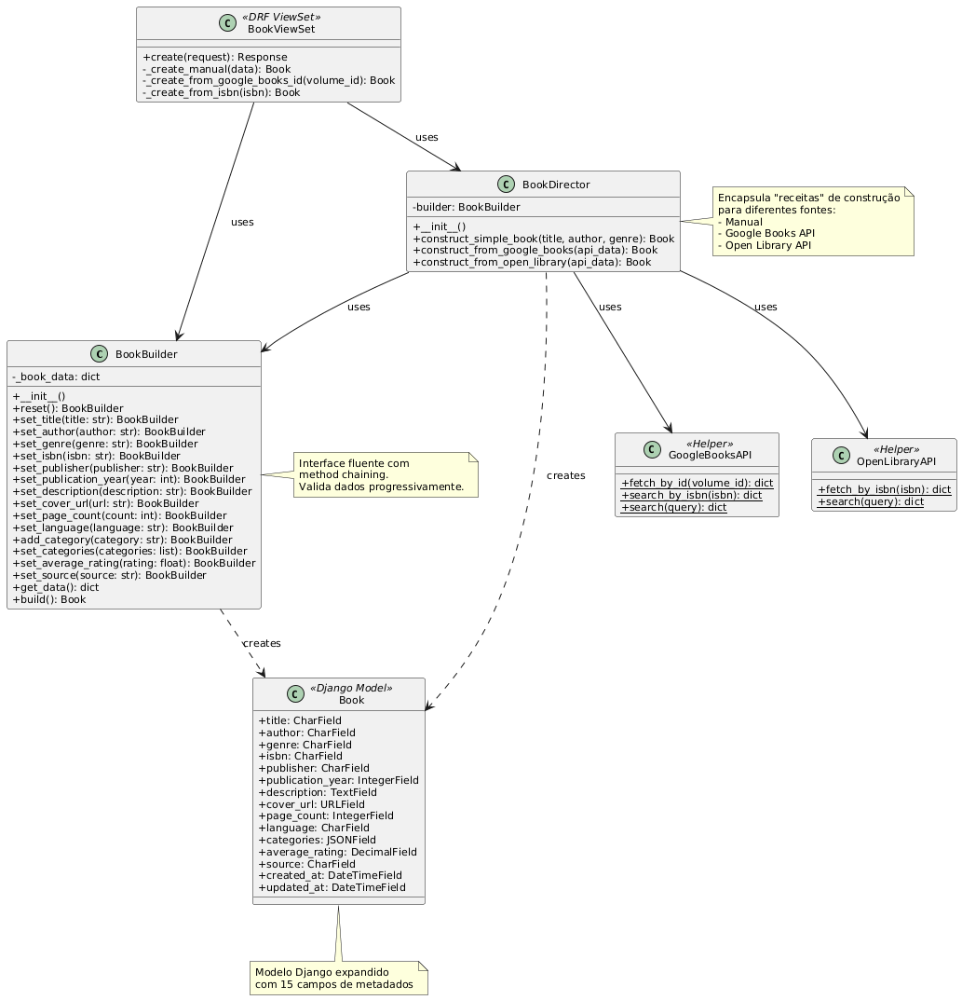
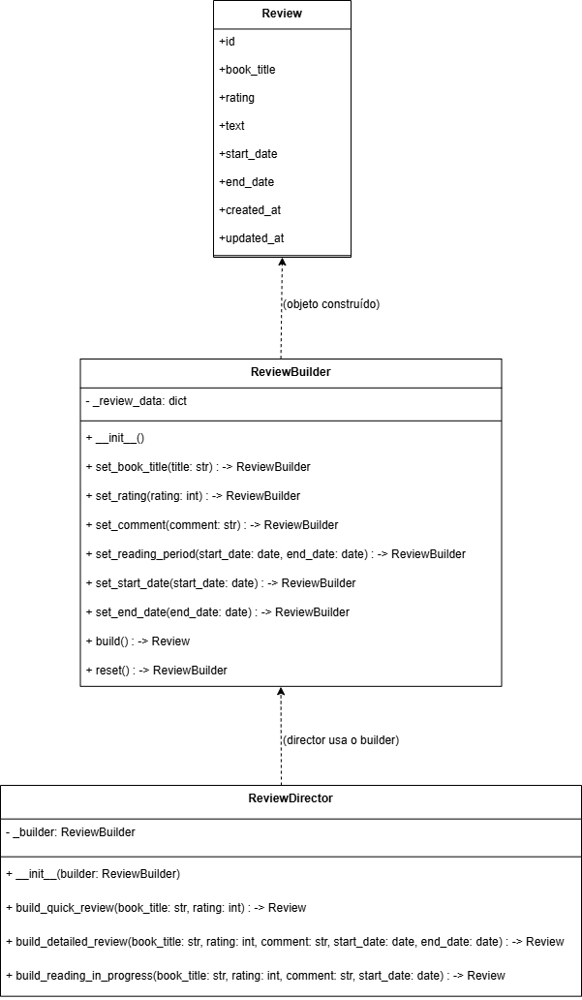

# 3.1.2. Builder

Nessa página constam duas aplicações do padrão de projeto Builder na aplicação do "EuRecomendo". [Builder Books](PadroesDeProjeto/3.1.2.Builder?id=_1-primeira-aplicação) e [Builder Review](https://unbarqdsw2025-2-turma01.github.io/2025.2-T01-G5_EuRecomendo_Entrega_03/#/PadroesDeProjeto/3.1.2.Builder?id=aplicação-2-review)

## Introdução

O Builder é um padrão criacional que separa a construção de um objeto complexo de sua representação, permitindo criar diferentes representações usando o mesmo processo de construção. Na aplicação "EuRecomendo", aplicamos este padrão para:

## **1. Primeira Aplicação** 

Criar objetos `Book` a partir de múltiplas fontes de dados: entrada manual, Google Books API e Open Library API. O padrão é implementado através das classes `BookBuilder` (construtor com validações) e `BookDirector` (receitas de construção).

Vale ressaltar que o padrão Builder é normalmente usado:
- A criação de um objeto é complexa, com muitos parâmetros opcionais ou passos de inicialização;
- Quer evitar construtores gigantes, com muitos argumentos;
- Deseja manter o código de construção separado da lógica do objeto final;
- Precisa criar diferentes versões ou representações de um mesmo produto, por exemplo, um documento em HTML ou em PDF.

## Objetivo

Para a nossa *primeira* aplicação do padrão:
- Desacoplar a criação de objetos `Book` complexos da lógica de negócio da API.
- Fornecer interface fluente (method chaining) para construção incremental.
- Validar dados progressivamente durante a construção.
- Encapsular diferentes "receitas" de construção via Director (manual, Google Books, Open Library).
- Garantir consistência dos dados independentemente da fonte.


## Vantagens

Para a nossa *primeira* aplicação do padrão:
- **Separação de responsabilidades**: A lógica de construção fica isolada do modelo Django.
- **Validação incremental**: Cada setter valida os dados antes de armazená-los.
- **Interface fluente**: Melhora a legibilidade do código através de method chaining.
- **Reutilização**: Director encapsula receitas complexas, evitando duplicação.
- **Flexibilidade**: Novos campos ou fontes de dados podem ser adicionados sem quebrar código existente.


## Desvantagens

Para a nossa *primeira* aplicação do padrão:
- **Complexidade adicional**: Introduz mais classes (Builder + Director) para problemas simples.
- **Overhead de memória**: Mantém estado intermediário antes de criar o objeto final.
- **Curva de aprendizado**: Desenvolvedores precisam entender o padrão antes de usar.


## Metodologia

Para a realização deste projeto, adotamos uma abordagem estruturada, utilizando um conjunto de ferramentas e tecnologias para o desenvolvimento, documentação e validação do padrão builder. Abaixo estão listadas as ferramentas empregadas e suas respectivas finalidades:


Para a nossa *primeira* aplicação do padrão:
- **Ferramentas**: VS Code, Django/DRF (implementação), PostgreSQL (persistência), Docker (execução), Postman (testes de API), pytest/Django TestCase (testes unitários).
- **APIs externas**: Google Books API (https://www.googleapis.com/books/v1/volumes), Open Library API (https://openlibrary.org/api).

**Referências** 
- Gamma, E. et al. **Design Patterns: Elements of Reusable Object-Oriented Software**. Addison-Wesley, 1995.
- Google Books API Documentation: https://developers.google.com/books/docs/v1/using
- Open Library API Documentation: https://openlibrary.org/developers/api
- Django Best Practices: https://docs.djangoproject.com/en/stable/

O desenvolvimento seguiu uma abordagem iterativa, iniciando com o estudo aprofundado do padrão Builder por meio das referências bibliográficas: citadas a cima. Essas fontes foram fundamentais para compreender os conceitos teóricos do padrão, suas aplicações práticas e melhores práticas de implementação, orientando a elaboração dos diagramas e a implementação do código, além da redação do documento. A documentação foi desenvolvida em conjunto e em paralelo, consolidando os aprendizados teóricos e práticos. Os resultados foram validados por meio de testes e gravações no YouTube, garantindo a correta aplicação do padrão.

## Para a *primeira* aplicação
### Diagramas

<font size="2"><p style="text-align: center"><b>Figura 1:</b> Diagrama Builder Books</div>

<div style="text-align: center;">



</div>

<font size="2"><p style="text-align: center"><b>Autores:</b> Bruno e Luis, 2025</p></font>


### Código

O modelo `Book` foi expandido para suportar metadados ricos:

```python
class Book(models.Model):
    # Campos básicos
    title = models.CharField(max_length=255)
    author = models.CharField(max_length=255)
    genre = models.CharField(max_length=100, blank=True)

    # Metadados do livro
    isbn = models.CharField(max_length=13, blank=True, null=True, unique=True)
    publisher = models.CharField(max_length=255, blank=True)
    publication_year = models.IntegerField(blank=True, null=True)
    description = models.TextField(blank=True)
    cover_url = models.URLField(max_length=500, blank=True, null=True)
    page_count = models.IntegerField(blank=True, null=True)
    language = models.CharField(max_length=10, default='pt-BR')

    # Campos JSON para dados flexíveis
    categories = models.JSONField(default=list, blank=True)
    average_rating = models.DecimalField(max_digits=3, decimal_places=2,
                                        blank=True, null=True)

    # Metadados de controle
    created_at = models.DateTimeField(auto_now_add=True)
    updated_at = models.DateTimeField(auto_now=True)
    source = models.CharField(max_length=50, default='manual')
```

#### BookBuilder (backend/books/builders.py)
Implementa a interface fluente com validações:

```python
class BookBuilder:
    def __init__(self):
        self.reset()

    def reset(self):
        """Limpa os dados para nova construção."""
        self._book_data = {
            'categories': [],
            'language': 'pt-BR',
            'source': 'manual'
        }
        return self

    def set_title(self, title: str):
        """Define o título com validação de tamanho."""
        if not title or not title.strip():
            raise ValueError("Título não pode ser vazio")
        title = title.strip()
        if len(title) > 255:
            raise ValueError(f"Título muito longo (máx. 255 caracteres). "
                           f"Recebido: {len(title)}")
        self._book_data['title'] = title
        return self

    def set_isbn(self, isbn: str):
        """Valida e limpa ISBN (10 ou 13 dígitos)."""
        if not isbn:
            return self
        cleaned_isbn = ''.join(c for c in isbn if c.isdigit())
        if len(cleaned_isbn) not in [10, 13]:
            raise ValueError(f"ISBN inválido. Deve ter 10 ou 13 dígitos. "
                           f"Recebido: {len(cleaned_isbn)}")
        self._book_data['isbn'] = cleaned_isbn
        return self

    def set_publication_year(self, year: int):
        """Valida ano de publicação."""
        if year is None:
            return self
        if not isinstance(year, int):
            raise ValueError(f"Ano deve ser um inteiro. "
                           f"Recebido: {type(year).__name__}")
        if year < 1000 or year > 2030:
            raise ValueError(f"Ano de publicação inválido: {year}. "
                           f"Deve estar entre 1000 e 2030")
        self._book_data['publication_year'] = year
        return self

    def build(self) -> Book:
        """Cria e persiste o objeto Book."""
        if 'title' not in self._book_data or not self._book_data['title']:
            raise ValueError("Título é obrigatório para criar um livro")
        if 'author' not in self._book_data or not self._book_data['author']:
            raise ValueError("Autor é obrigatório para criar um livro")

        book = Book(**self._book_data)
        book.save()
        self.reset()  # Limpa para próxima construção
        return book
```

#### BookDirector (backend/books/builders.py)
Encapsula receitas de construção para diferentes fontes:

```python
class BookDirector:
    def __init__(self):
        self.builder = BookBuilder()

    def construct_simple_book(self, title: str, author: str,
                             genre: str = "") -> Book:
        """Cria livro com dados mínimos (entrada manual)."""
        return (self.builder
            .reset()
            .set_title(title)
            .set_author(author)
            .set_genre(genre)
            .set_source('manual')
            .build())

    def construct_from_google_books(self, api_data: dict) -> Book:
        """Constrói livro a partir de dados do Google Books."""
        volume_info = api_data.get('volumeInfo', {})
        self.builder.reset()

        # Título (obrigatório)
        title = volume_info.get('title', '')
        if not title:
            raise ValueError("Google Books API retornou livro sem título")
        self.builder.set_title(title)

        # Autores
        authors = volume_info.get('authors', [])
        if authors:
            self.builder.set_author(', '.join(authors))
        else:
            self.builder.set_author('Autor Desconhecido')

        # ISBN (preferir ISBN-13)
        identifiers = volume_info.get('industryIdentifiers', [])
        for identifier in identifiers:
            if identifier.get('type') == 'ISBN_13':
                self.builder.set_isbn(identifier.get('identifier', ''))
                break
        else:
            # Fallback para ISBN-10
            for identifier in identifiers:
                if identifier.get('type') == 'ISBN_10':
                    self.builder.set_isbn(identifier.get('identifier', ''))
                    break

        # Ano (extrair de "2008-08-01" -> 2008)
        published_date = volume_info.get('publishedDate', '')
        if published_date:
            try:
                year = int(published_date[:4])
                self.builder.set_publication_year(year)
            except (ValueError, IndexError):
                pass

        # Outros metadados
        self.builder.set_publisher(volume_info.get('publisher', ''))
        self.builder.set_description(volume_info.get('description', ''))
        self.builder.set_page_count(volume_info.get('pageCount'))
        self.builder.set_language(volume_info.get('language', 'pt-BR'))
        self.builder.set_average_rating(volume_info.get('averageRating'))

        # Capa
        image_links = volume_info.get('imageLinks', {})
        cover_url = image_links.get('thumbnail', '')
        if cover_url:
            self.builder.set_cover_url(cover_url)

        # Categorias e gênero
        categories = volume_info.get('categories', [])
        if categories:
            self.builder.set_genre(categories[0])
            self.builder.set_categories(categories)

        self.builder.set_source('google_books')
        return self.builder.build()
```

#### Integração com API (backend/books/views.py)
O `BookViewSet` usa o Builder para suportar três modos de criação:

```python
class BookViewSet(viewsets.ModelViewSet):
    def create(self, request, *args, **kwargs):
        serializer = BookCreateSerializer(data=request.data)
        serializer.is_valid(raise_exception=True)
        data = serializer.validated_data

        try:
            if data.get('google_books_id'):
                book = self._create_from_google_books_id(
                    data['google_books_id']
                )
            elif data.get('import_isbn'):
                book = self._create_from_isbn(data['import_isbn'])
            else:
                book = self._create_manual(data)

            output_serializer = BookSerializer(book)
            return Response(output_serializer.data,
                          status=status.HTTP_201_CREATED)
        except ValueError as e:
            return Response({'error': str(e)},
                          status=status.HTTP_400_BAD_REQUEST)

    def _create_manual(self, data: dict) -> Book:
        """Criação manual usando Builder."""
        builder = BookBuilder()
        if 'title' in data and data['title']:
            builder.set_title(data['title'])
        if 'author' in data and data['author']:
            builder.set_author(data['author'])
        # ... outros campos
        builder.set_source('manual')
        return builder.build()

    def _create_from_google_books_id(self, volume_id: str) -> Book:
        """Importação via Google Books ID."""
        api_data = GoogleBooksAPI.fetch_by_id(volume_id)
        if not api_data:
            raise ValueError(f"Livro não encontrado: {volume_id}")

        director = BookDirector()
        return director.construct_from_google_books(api_data)
```


<font size="2"><p style="text-align: center"><b>Autores:</b> Bruno e Luis, 2025</p></font>

### Resultados do Código

#### 1. Criação Manual
```bash
POST /api/books/
{
  "title": "Clean Code",
  "author": "Robert C. Martin",
  "genre": "Técnico",
  "isbn": "9780132350884",
  "publication_year": 2008,
  "page_count": 464
}
```

Resposta: **201 CREATED**
```json
{
  "id": 1,
  "title": "Clean Code",
  "author": "Robert C. Martin",
  "genre": "Técnico",
  "isbn": "9780132350884",
  "publication_year": 2008,
  "page_count": 464,
  "source": "manual",
  "created_at": "2025-10-21T10:30:00Z"
}
```

#### 2. Importação por Google Books ID
```bash
POST /api/books/
{
  "google_books_id": "hjEFCAAAQBAJ"
}
```

Resposta: **201 CREATED** com todos os metadados da API (título, autor, ISBN, ano, descrição, capa, categorias, rating, etc.)

#### 3. Importação por ISBN
```bash
POST /api/books/
{
  "import_isbn": "9780132350884"
}
```

Resposta: **201 CREATED** com dados do Google Books (busca automática pelo ISBN)

#### 4. Validação de Erro
```bash
POST /api/books/
{
  "title": "",
  "author": "Test"
}
```

Resposta: **400 BAD REQUEST**
```json
{
  "error": "Título não pode ser vazio"
}
```

### Passo a Passo para Rodar os Códigos

Primeiro deve-se entrar na branch `feat-Bookbuilder_luis_e_bruno`

#### 1. Subir containers Docker
```bash
cd backend
docker compose up --build -d
```

Verificar containers:
```bash
docker compose ps
```

Esperado: `backend-web-1` (Django) e `backend-db-1` (PostgreSQL) rodando.

#### 2. Aplicar migrações
```bash
docker compose exec web python manage.py makemigrations books
docker compose exec web python manage.py migrate
```

#### 3. Criar superusuário
```bash
docker compose exec web python manage.py createsuperuser
```

Exemplo:
- Username: `admin`
- Password: `admin123`

#### 4. Obter token JWT
```bash
curl -X POST http://localhost:8001/api/token/ \
  -H "Content-Type: application/json" \
  -d '{"username":"admin","password":"admin123"}'
```

Resposta:
```json
{
  "access": "<access_token>",
  "refresh": "<refresh_token>"
}
```

#### 5. Testar criação manual
```bash
TOKEN="<access_token>"

curl -X POST http://localhost:8001/api/books/ \
  -H "Content-Type: application/json" \
  -H "Authorization: Bearer $TOKEN" \
  -d '{
    "title": "The Pragmatic Programmer",
    "author": "Andrew Hunt, David Thomas",
    "genre": "Técnico",
    "isbn": "9780135957059",
    "publication_year": 2019,
    "page_count": 352
  }'
```

#### 6. Testar importação do Google Books
```bash
curl -X POST http://localhost:8001/api/books/ \
  -H "Content-Type: application/json" \
  -H "Authorization: Bearer $TOKEN" \
  -d '{"google_books_id": "hjEFCAAAQBAJ"}'
```

#### 7. Testar importação por ISBN
```bash
curl -X POST http://localhost:8001/api/books/ \
  -H "Content-Type: application/json" \
  -H "Authorization: Bearer $TOKEN" \
  -d '{"import_isbn": "9780132350884"}'
```

#### 8. Buscar no Google Books (sem criar)
```bash
curl "http://localhost:8001/api/books/search-google-books/?q=clean+code"
```

#### 9. Listar livros criados
```bash
curl http://localhost:8001/api/books/
```

#### 10. Verificar no Django Admin
1. Acessar: http://localhost:8001/admin
2. Login: `admin` / `admin123`
3. Navegar para **Books**
4. Verificar livros com todos os metadados
5. Testar filtros (Source, Genre, Language)

### Vídeo

<font size="2"><p style="text-align: center">Vídeo 1 - Factory Method.</p></font>


<center>
<iframe width="560" height="315"
src="https://www.youtube.com/embed/8k_LzAtg_Pg"
frameborder="0"
allow="accelerometer; autoplay; clipboard-write; encrypted-media; gyroscope; picture-in-picture"
allowfullscreen>
</iframe>
</center>

<font size="2"><p style="text-align: center">Autor/es: [](), 2025.</p></font>


## Aplicação 2 - Review 

**2. Segunda Aplicação** Criar objetos Review (avaliações de livros) de forma flexível, permitindo definir título, nota, comentário e período de leitura. O padrão é implementado através das classes ReviewBuilder (construtor com validações) e ReviewDirector (receitas de construção).

Vale ressaltar que o padrão Builder é normalmente usado quando:

- A criação de um objeto é complexa, com múltiplos parâmetros opcionais;
- Quer evitar construtores gigantes, com muitos argumentos;
- Deseja manter o código de construção separado da lógica do objeto final;
- Precisa criar diferentes versões ou representações de um mesmo produto (no caso, avaliações rápidas, detalhadas ou em progresso).

## Objetivo

Para a nossa segunda aplicação do padrão:

- Desacoplar a criação de objetos Review da lógica de negócio da API;
- Fornecer interface fluente (method chaining) para construção incremental;
- Validar dados progressivamente durante a construção (nota válida, datas coerentes, título obrigatório);
- Encapsular diferentes "receitas" de construção via Director (avaliação rápida, detalhada ou em andamento);
- Garantir consistência dos dados independentemente do tipo de avaliação.

## Vantagens

Para a segunda aplicação do padrão:

- Separação de responsabilidades: A lógica de construção fica isolada do modelo Django Review;
- Validação incremental: Cada setter valida os dados antes de armazená-los;
- Interface fluente: Melhora a legibilidade do código através de method chaining;
- Reutilização: Director encapsula receitas complexas, evitando duplicação de código;
- Flexibilidade: Novos campos ou tipos de avaliações podem ser adicionados sem quebrar código existente.

## Desvantagens

Para a nossa segunda aplicação do padrão:

- Complexidade adicional: Introduz mais classes (Builder + Director) para problemas simples;
- Overhead de memória: Mantém estado intermediário antes de criar o objeto final;
- Curva de aprendizado: Desenvolvedores precisam compreender o padrão antes de utilizá-lo.

## Metodologia

Para a realização deste projeto, adotamos uma abordagem estruturada, utilizando um conjunto de ferramentas e tecnologias para o desenvolvimento, documentação e validação do padrão Builder:

- Ferramentas: VS Code, Django/DRF (implementação), SQLite/PostgreSQL (persistência), Docker (execução), Postman (testes de API), pytest/Django TestCase (testes unitários);
- Integração com a aplicação: ReviewViewSet do Django REST Framework utiliza o Builder e o Director para criar avaliações de livros nos diferentes modos disponíveis (rápida, detalhada, em progresso).

## Referências

Gamma, E. et al. Design Patterns: Elements of Reusable Object-Oriented Software. Addison-Wesley, 1995.

Django Best Practices: https://docs.djangoproject.com/en/stable/

### Diagramas

<font size="2"><p style="text-align: center"><b>Figura 2:</b> Diagrama Builder - Review</div>

<div style="text-align: center;">



</div>

<font size="2"><p style="text-align: center"><b>Autor:</b> José Eduardo, 2025</p></font>

### Código

O módulo `Review` foi expandido para suportar avaliações detalhadas de livros, incluindo nota, comentário e período de leitura.

`ReviewBuilder`  (backend/reviews/builders.py)

Implementa a interface fluente para construção de avaliações, com validações:

```python
class ReviewBuilder:
    def __init__(self):
        self._review_data = {}
    
    def set_book_title(self, title: str) -> 'ReviewBuilder':
        """Define o título do livro."""
        self._review_data['book_title'] = title
        return self
    
    def set_rating(self, rating: int) -> 'ReviewBuilder':
        """Define a nota do livro (1 a 5 estrelas)."""
        if not 1 <= rating <= 5:
            raise ValueError("Avaliação deve estar entre 1 e 5 estrelas")
        self._review_data['rating'] = rating
        return self
    
    def set_comment(self, comment: str) -> 'ReviewBuilder':
        """Adiciona comentário à avaliação."""
        self._review_data['text'] = comment
        return self
    
    def set_reading_period(self, start_date: date, end_date: date) -> 'ReviewBuilder':
        """Define período de leitura (início e fim)."""
        if start_date and end_date and start_date > end_date:
            raise ValueError("Data de início não pode ser posterior à data de fim")
        self._review_data['start_date'] = start_date
        self._review_data['end_date'] = end_date
        return self
    
    def set_start_date(self, start_date: date) -> 'ReviewBuilder':
        """Define a data de início da leitura."""
        self._review_data['start_date'] = start_date
        return self
    
    def set_end_date(self, end_date: date) -> 'ReviewBuilder':
        """Define a data de término da leitura."""
        self._review_data['end_date'] = end_date
        return self
    
    def build(self) -> Review:
        """Cria e salva a avaliação no banco de dados."""
        if 'book_title' not in self._review_data:
            raise ValueError("Título do livro é obrigatório")
        if 'rating' not in self._review_data:
            raise ValueError("Avaliação é obrigatória")
        return Review.objects.create(**self._review_data)
    
    def reset(self) -> 'ReviewBuilder':
        """Limpa os dados para iniciar nova construção."""
        self._review_data = {}
        return self

```

<font size="2"><p style="text-align: center"><b>Autor:</b> [José Eduardo](), 2025</p></font>

`ReviewDirector` (backend/reviews/builders.py)

Encapsula receitas de construção para diferentes tipos de avaliações:
```python
class ReviewDirector:
    def __init__(self, builder: ReviewBuilder):
        self._builder = builder
    
    def build_quick_review(self, book_title: str, rating: int) -> Review:
        """Avaliação rápida com apenas título e nota."""
        return (self._builder
                .reset()
                .set_book_title(book_title)
                .set_rating(rating)
                .build())
    
    def build_detailed_review(self, book_title: str, rating: int, 
                              comment: str, start_date: date, end_date: date) -> Review:
        """Avaliação detalhada com comentário e período de leitura."""
        return (self._builder
                .reset()
                .set_book_title(book_title)
                .set_rating(rating)
                .set_comment(comment)
                .set_reading_period(start_date, end_date)
                .build())
    
    def build_reading_in_progress(self, book_title: str, rating: int, 
                                  comment: str, start_date: date) -> Review:
        """Avaliação de livro em progresso, sem data de término."""
        return (self._builder
                .reset()
                .set_book_title(book_title)
                .set_rating(rating)
                .set_comment(comment)
                .set_start_date(start_date)
                .build())


```

<font size="2"><p style="text-align: center"><b>Autor:</b> [José Eduardo](), 2025</p></font>

`Integração com API` (backend/reviews/views.py)

O ReviewViewSet utiliza o Builder e o Director para criar avaliações em diferentes modos:

```python
class ReviewViewSet(viewsets.ModelViewSet):
    def create(self, request, *args, **kwargs):
        serializer = ReviewSerializer(data=request.data)
        serializer.is_valid(raise_exception=True)
        data = serializer.validated_data

        builder = ReviewBuilder()
        director = ReviewDirector(builder)

        if data.get('detailed'):
            review = director.build_detailed_review(
                book_title=data['book_title'],
                rating=data['rating'],
                comment=data.get('text', ''),
                start_date=data.get('start_date', None),
                end_date=data.get('end_date', None)
            )
        elif data.get('in_progress'):
            review = director.build_reading_in_progress(
                book_title=data['book_title'],
                rating=data['rating'],
                comment=data.get('text', ''),
                start_date=data.get('start_date', None)
            )
        else:
            review = director.build_quick_review(
                book_title=data['book_title'],
                rating=data['rating']
            )

        output_serializer = ReviewSerializer(review)
        return Response(output_serializer.data, status=status.HTTP_201_CREATED)

```

<font size="2"><p style="text-align: center"><b>Autor:</b> [José Eduardo](), 2025</p></font>

### Passo a Passo para Rodar os Códigos

Entre na branch `codes-jose`

#### 1. Subir containers Docker
```bash
cd backend
docker compose up --build -d
```

Verificar containers:
```bash
docker compose ps
```


#### 2. Aplicar migrações
```bash
docker compose exec web python manage.py makemigrations reviews
docker compose exec web python manage.py migrate
```

#### 3. Criar superusuário
```bash
docker compose exec web python manage.py createsuperuser
```

Exemplo:
- Username: `admin`
- email: `admin@admin.com`
- Password: `admin123`


#### 4.1 Obter token JWT
```bash
curl -X POST http://localhost:8000/api/token/ \
  -H "Content-Type: application/json" \
  -d '{"username":"admin","password":"admin123"}'
```

Resposta:
```json
{
  "access": "<access_token>",
  "refresh": "<refresh_token>"
}
```

#### 5. Testar criação manual via API
```bash
TOKEN="<access_token>"

curl -X POST http://localhost:8000/api/reviews/ \
  -H "Content-Type: application/json" \
  -H "Authorization: Bearer $TOKEN" \
  -d '{
        "book_title": "Clean Code",
        "rating": 5,
        "text": "Excelente livro!",
        "start_date": "2025-01-01",
        "end_date": "2025-01-15"
      }'

```

#### 6. GET para listar todas as reviews, usando o token, para conferir se o POST funcionou:
```bash
curl -X GET http://localhost:8000/api/reviews/ \
  -H "Authorization: Bearer $TOKEN"

```

### Vídeo

<font size="2"><p style="text-align: center">Vídeo 2 - Decorator Builder </p></font>

<center>
<iframe width="560" height="315" src="https://www.youtube.com/embed/IearXBRgNfw" title="YouTube video player" frameborder="0" allow="accelerometer; autoplay; clipboard-write; encrypted-media; gyroscope; picture-in-picture; web-share" referrerpolicy="strict-origin-when-cross-origin" allowfullscreen></iframe>
</center>

<font size="2"><p style="text-align: center">Autor: [Jose Eduardo](), 2025.</p></font>

## Bibliografia

- Gamma, E. et al. **Design Patterns: Elements of Reusable Object-Oriented Software**. Addison-Wesley, 1995.
- Google Books API Documentation: https://developers.google.com/books/docs/v1/using
- Open Library API Documentation: https://openlibrary.org/developers/api
- Django Best Practices: https://docs.djangoproject.com/en/stable/


### Histórico de Versões

| Versão | Data       | Descrição                                                                    | Autor(es)                                                                                        | Revisor(es)                                   | Detalhes da Revisão |
| ------ | ---------- | ---------------------------------------------------------------------------- | ------------------------------------------------------------------------------------------------ | --------------------------------------------- | ------------------- |
| 0.1    | 21/10/2025 | Criação inicial do documento                      | [Sophia Silva](https://github.com/sophiassilva) | [Renan Vieira]() |                     |
| 0.2    | 23/10/2025 | Incremento da primeira aplicação                      | [Bruno Reis](https://github.com/BrunoBReis) | [Luis Lima](https://github.com/Luidooo) |                     |
| 0.3    | 23/10/2025 | Mudancas da primeira aplicação                      | [Luis Lima](https://github.com/Luidooo) | [Bruno Reis](https://github.com/BrunoBReis) | |     
| 0.4    | 23/10/2025 | Adição da segunda aplicação                       | [Jose Eduardo](https://github.com/jevprado) | [Sophia Silva](https://github.com/sophiassilva) | |         
| 0.5    | 24/10/2025 | Adicionando vídeo builder                      | [Jose Eduardo](https://github.com/jevprado) | [Sophia Silva](https://github.com/sophiassilva) | |             
