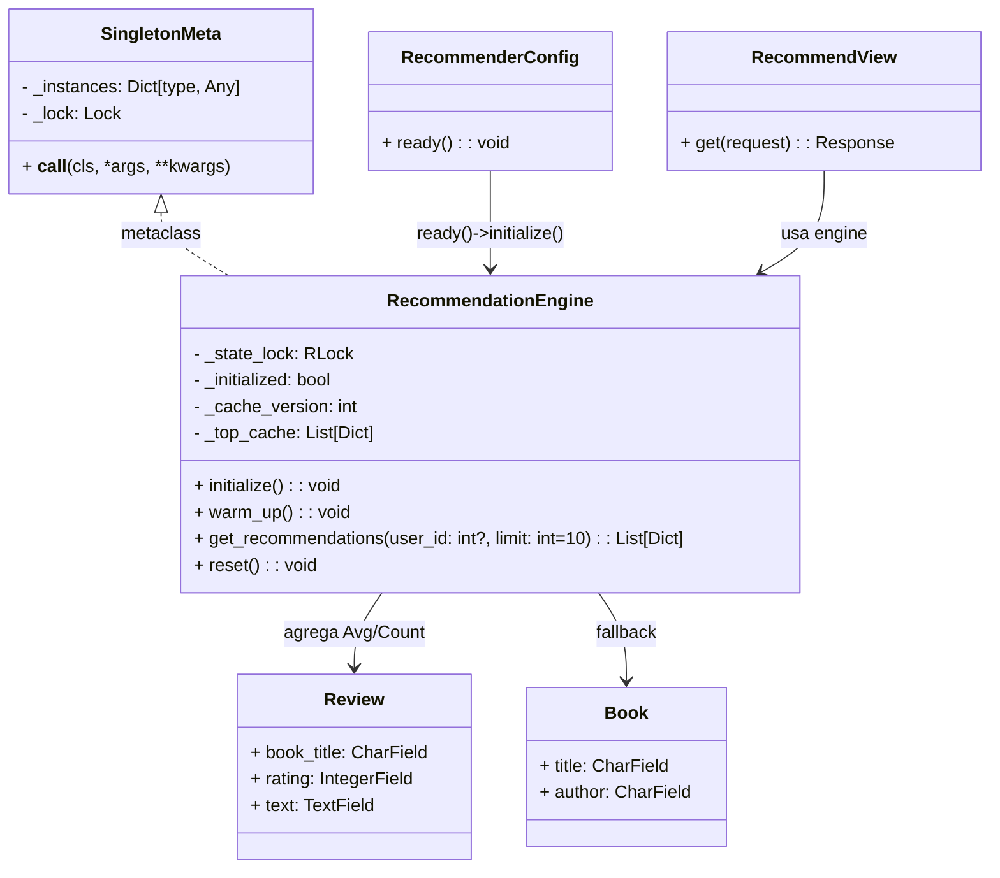
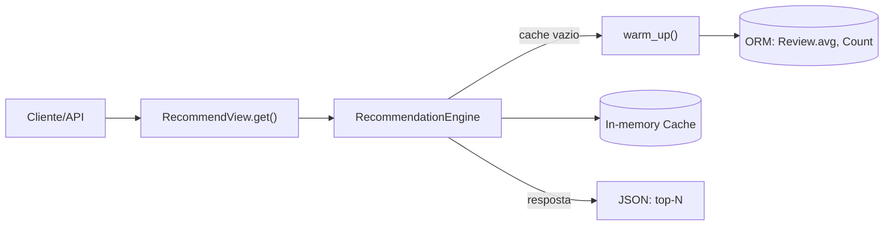

# 3.1.4. Singleton

## Introdução

O Singleton é um padrão criacional que garante a existência de uma única instância de uma classe e fornece um ponto global de acesso a ela. Na aplicação "EuRecomendo", aplicamos este padrão para centralizar o motor de recomendações em memória durante o desenvolvimento, evitando recomputações custosas e reduzindo latência no endpoint público de recomendações.

Para nossa implementação, utilizamos uma metaclasse thread-safe com double-checked locking, inicialização preguiçosa e um cache interno aquecido por agregações do ORM.

## Objetivo

- Manter uma única instância do motor de recomendações por processo (dev).
- Inicializar de forma preguiçosa (lazy) e idempotente, aquecendo o cache apenas uma vez.
- Garantir segurança de concorrência com travas (Locks/RLocks) e consistência do estado.
- Expor uma API simples para a camada REST retornar recomendações rapidamente.

## Vantagens

- Desempenho: consultas agregadas e aquecimento executados uma única vez por processo.
- Baixa latência: respostas subsequentes servidas do cache em memória.
- Simplicidade de uso: dependência acessada como instância global estável.
- Testabilidade: ponto de reset dedicado para cenários de teste.

## Desvantagens

- Escopo por processo: em produção multi-processo (gunicorn/uwsgi), cada worker teria seu próprio cache.
- Acoplamento: uso global pode dificultar mocking sem pontos de injeção.
- Ciclo de vida do Django: aquecer o cache em AppConfig.ready pode gerar avisos se o banco ainda não estiver pronto; mitigamos com captura de exceções e warm-up sob demanda.

## Metodologia

- Ferramentas: VS Code, Django/DRF, SQLite (dev), Postman/curl, pytest (opcional).
- Implementação: metaclasse Singleton, engine com cache, integração em AppConfig.ready, endpoint REST.
- Semeadura de dados (seed) idempotente para demonstração do endpoint com médias e votos.

## Diagramas

<font size="2"><p style="text-align: center"><b>Figura 1:</b> Diagrama de Classes — Singleton de Recomendações</p></font>




<font size="2"><p style="text-align: center"><b>Figura 2:</b> Fluxo de Chamada — Endpoint de Recomendações</p></font>



## Código

Trecho essencial do Singleton:

```python
# engine.py (excerto)
class SingletonMeta(type):
    _instances: Dict[type, Any] = {}
    _lock: threading.Lock = threading.Lock()

    def __call__(cls, *args, **kwargs):
        if cls not in cls._instances:
            with cls._lock:
                if cls not in cls._instances:
                    instance = super().__call__(*args, **kwargs)
                    cls._instances[cls] = instance
        return cls._instances[cls]


class RecommendationEngine(metaclass=SingletonMeta):
    def __init__(self) -> None:
        self._state_lock = threading.RLock()
        self._initialized = False
        self._cache_version = 0
        self._top_cache: List[Dict[str, Any]] = []

    def initialize(self) -> None:
        if not self._initialized:
            with self._state_lock:
                if not self._initialized:
                    try:
                        self.warm_up()
                        self._initialized = True
                        logger.info("RecommendationEngine initialized")
                    except Exception as exc:
                        logger.exception("Failed to initialize engine: %s", exc)

    def warm_up(self) -> None:
        from django.db.models import Avg, Count
        from reviews.models import Review  # type: ignore
        top = (
            Review.objects.values("book_title")
            .annotate(avg_rating=Avg("rating"), votes=Count("id"))
            .order_by("-avg_rating", "-votes")[:50]
        )
        with self._state_lock:
            self._top_cache = [
                {
                    "book_title": row["book_title"],
                    "avg_rating": (float(row["avg_rating"]) if row["avg_rating"] is not None else None),
                    "votes": int(row["votes"]),
                }
                for row in top
            ]
            self._cache_version += 1

    def get_recommendations(self, user_id: Optional[int] = None, limit: int = 10) -> List[Dict[str, Any]]:
        self.initialize()
        with self._state_lock:
            if not self._top_cache:
                try:
                    self.warm_up()
                except Exception as exc:
                    logger.exception("On-demand warm_up failed: %s", exc)

            data = list(self._top_cache[:limit])
            if not data:
                try:
                    from books.models import Book  # type: ignore
                    data = [{"book_title": b.title, "avg_rating": None, "votes": 0} for b in Book.objects.all()[:limit]]
                except Exception:
                    data = []
        return data

    def reset(self) -> None:
        with self._state_lock:
            self._initialized = False
            self._top_cache.clear()
            self._cache_version += 1


# Instancia única por processo
engine = RecommendationEngine()
```

Uso na view:

```python
# recommender/views.py (excerto)
class RecommendView(APIView):
    def get(self, request):
        limit = int(request.query_params.get("limit", "10") or 10)
        recs = engine.get_recommendations(user_id=getattr(request.user, "id", None), limit=limit)
        return Response({"recommendations": recs})
```

## Resultados do Código

Após executar o seed, o endpoint retorna (exemplo real):

```json
{"recommendations":[
  {"book_title":"Clean Code","avg_rating":4.75,"votes":4},
  {"book_title":"Design Patterns","avg_rating":4.75,"votes":4},
  {"book_title":"The Pragmatic Programmer","avg_rating":4.6,"votes":5},
  {"book_title":"Domain-Driven Design","avg_rating":4.333333333333333,"votes":3},
  {"book_title":"Refactoring","avg_rating":4.25,"votes":4}
]}
```

## Passo a Passo para Rodar os Códigos

1. Criar ambiente virtual e instalar dependências:
   ```bash
   cd backend
   python -m venv .venv
   source .venv/bin/activate
   pip install -r requirements.txt
   ```
2. Aplicar migrações:
   ```bash
   .venv/bin/python manage.py migrate
   ```
3. Executar o servidor:
   ```bash
   .venv/bin/python manage.py runserver
   ```
4. Popular dados e aquecer cache:
   ```bash
   .venv/bin/python manage.py seed_recommendations
   ```
5. Testar endpoint:
   ```bash
   curl -sS http://127.0.0.1:8000/api/recommender/recommend/
   curl -sS "http://127.0.0.1:8000/api/recommender/recommend/?limit=5"
   ```

## Considerações Arquiteturais

- Em produção, prefira cache compartilhado (Redis/Memcached) e warming assíncrono (Celery).
- Para testes, utilize `def reset()` para isolar cenários.
- Evite queries em `def ready()` em pipelines de CI; use sinais pós-migração quando necessário.

## Video

<iframe width="560" height="315" src="" title="YouTube video player" frameborder="0" allow="accelerometer; autoplay; clipboard-write; encrypted-media; gyroscope; picture-in-picture; web-share" referrerpolicy="strict-origin-when-cross-origin" allowfullscreen></iframe> 

## Bibliografia

- Gamma, E. et al. Design Patterns: Elements of Reusable Object-Oriented Software. Addison-Wesley, 1995.
- Django Best Practices — AppConfig, Signals, Caching.

### Histórico de Versões

| Versão | Data       | Descrição                                           | Autor(es)             | Revisor(es) |
| ------ | ---------- | --------------------------------------------------- | --------------------- | ----------- |
| 0.1    | 24/10/2025 | Criação inicial do documento de Singleton (dev)    | Pedro Braga | — |
| 0.2    | 24/10/2025 | Adicao do video de apresentacao da execucao do codigo | Pedro Braga | — |
