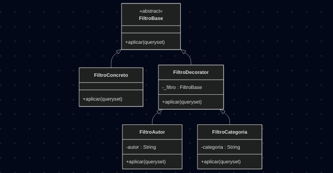

# 3.2.1. Decorator

## Introdução

Decorator (em português: decorador) é um padrão de design estrutural que permite anexar novos comportamentos a objetos colocando-os dentro de objetos wrapper especiais que contêm os comportamentos. Ele permite estruturar a lógica de negócios em camadas, criar um decorador para cada camada e compor objetos com diversas combinações dessa lógica em tempo de execução. O código do cliente pode tratar todos esses objetos da mesma maneira, pois todos seguem uma interface comum.

É comumente aplicado em cenários nos quais:
- É preciso atribuir comportamentos extras a objetos em tempo de execução sem quebrar o código que usa esses objetos;
- Quando não for possível estender o comportamento de um objeto usando herança.

Foram aplicados os conceitos do padrão Decorator nas funcionalidades de pesquisa de livros (UC04 - Pesquisar Livro) e avaliação de livros (UC05 - Avaliar Livro) no sistema Eu Recomendo.

## Objetivo

O principal objetivo do decorator é adicionar novos comportamentos a um objeto de forma dinâmica, sem alterar o seu código-fonte original. 


## Vantagens

O uso do padrão decorator oferece diversos benefícios, incluindo:

- Estender o comportamento de um objeto sem criar uma nova subclasse;
- Adicionar ou remover responsabilidades de um objeto em tempo de execução;
- Combinar vários comportamentos envolvendo um objeto em vários decoradores;
- Princípio da Responsabilidade Única: dividir uma classe monolítica que implementa muitas variantes possíveis de comportamento em várias classes menores.


## Desvantagens

Apesar de suas vantagens, o decorator também apresenta algumas limitações:

- Dificuldade de remover um wrapper específico da pilha de wrappers;
- Dificuldade de implementar um decorador de forma que seu comportamento não dependa da ordem na pilha de decoradores;
- O código de configuração inicial das camadas pode parecer bem feio.


## Metodologia

Para a realização deste projeto, adotamos uma abordagem estruturada, utilizando um conjunto de ferramentas e tecnologias para o desenvolvimento:

- **Mermaid**: Utilizado para a criação dos diagramas que ilustram a estrutura do padrão, facilitando a visualização das relações entre classes e interfaces.
- **Visual Studio Code (VSCode)**: Empregado como ambiente de desenvolvimento integrado (IDE) para a escrita, edição e depuração do código-fonte.
- **YouTube**: Utilizado para gravar e compartilhar vídeos demonstrando o funcionamento do código implementado, permitindo a validação visual dos resultados.
- **Docsify**: Ferramenta usada para o desenvolvimento e geração da documentação do projeto, garantindo uma apresentação clara e acessível do conteúdo.
- **Django**: Framework principal utilizado para o desenvolvimento, estruturando o projeto;
- **Python**: Linguagem de programação adotada.

O desenvolvimento seguiu uma abordagem iterativa, iniciando com o estudo do padrão por meio das referências bibliográficas e a adequação ao caso de uso escolhido (Pesquisar Livro). A documentação foi desenvolvida em conjunto e em paralelo, consolidando os aprendizados. Os resultados foram validados por meio de teste de caixa-preta e vídeo no YouTube, garantindo a correta aplicação do padrão.


# Implementação 

## UC04 - [Pesquisar Livro](https://unbarqdsw2025-2-turma01.github.io/2025.2-T01-G5_EuRecomendo_Entrega_02/#/Modelagem/2.3.1.CasosDeUso)

O padrão decorator foi utilizado na pesquisa de livros, implementando a filtragem da pesquisa.

### Diagrama

<font size="2"><p style="text-align: center"><b>Figura 1:</b> Diagrama Filtros</div>

<div style="text-align: center;">



</div>

<font size="2"><p style="text-align: center"><b>Autores:</b> Renan Vieira e Sophia Silva, 2025</p></font>

### Código

Foram implementados os códigos no padrão Decorator. Seguem abaixo:

```python
class FiltroBase(ABC):
    @abstractmethod
    def aplicar(self, queryset):
        pass

class FiltroConcreto(FiltroBase):
    def aplicar(self, queryset):
        return queryset

class FiltroDecorator(FiltroBase):
    def __init__(self, filtro):
        self._filtro = filtro

class FiltroAutor(FiltroDecorator):
    def __init__(self, filtro, autor):
        super().__init__(filtro)
        self.autor = autor

    def aplicar(self, queryset):
        queryset = self._filtro.aplicar(queryset)
        return queryset.filter(author__icontains=self.autor)

class FiltroCategoria(FiltroDecorator):
    def __init__(self, filtro, categoria):
        super().__init__(filtro)
        self.categoria = categoria

    def aplicar(self, queryset):
        queryset = self._filtro.aplicar(queryset)
        return queryset.filter(genre__icontains=self.categoria)


```

<font size="2"><p style="text-align: center"><b>Autor/es:</b> Sophia Silva e Renan Vieira, 2025</p></font>


### Passo a Passo para Rodar os Códigos

Antes de tudo, certifique-se e ter o python3 e django admin instalado no seu computador.

1. Acesse a branch [Decorator - Sophia e Renan](https://github.com/UnBArqDsw2025-2-Turma01/2025.2-T01-G5_EuRecomendo_Entrega_03/tree/feat-decorator-templatemethod-sophia-renan) e faça download ou digite no terminal
```
git checkout feat-decorator-templatemethod-sophia-renan
```
2. No terminal, digite o seguinte comando para acessar a pasta 
``` 
cd gof-decorator-template/decorator
```
3. Rode as migrações com 
```python
python3 manage.py makemigrations
python3 manage.py migrate
```
4. Crie seu super usuário
```python
python3 manage.py createsuperuser
```
5. Execute o projeto com
```python
python3 manage.py runserver
```
6. Acesse o localhost no seu navegador, adicione o /admin/ no final da url e faça login com seu usuário. Adicione 3 livros novos.
7. Apague a url do admin, acesse /biblioteca/ e utilize os filtros para fazer a busca!


### Vídeo

<font size="2"><p style="text-align: center">Vídeo 1 - Decorator Method </p></font>

<center>
<iframe width="560" height="315" src="https://www.youtube.com/embed/reWdm0eQBhE?si=lX0uAvqe8xUnf5DX" title="YouTube video player" frameborder="0" allow="accelerometer; autoplay; clipboard-write; encrypted-media; gyroscope; picture-in-picture; web-share" referrerpolicy="strict-origin-when-cross-origin" allowfullscreen></iframe>
</center>

<font size="2"><p style="text-align: center">Autora: [Sophia Silva](), 2025.</p></font>

# Implementação 

## UC05 - [Avaliar livro](https://unbarqdsw2025-2-turma01.github.io/2025.2-T01-G5_EuRecomendo_Entrega_02/#/Modelagem/2.3.1.CasosDeUso)

O padrão decorator foi utilizado na avaliação de livros. 

### Diagrama

<font size="2"><p style="text-align: center"><b>Figura 2:</b> Diagrama </div>

<div style="text-align: center;">


</div>

<font size="2"><p style="text-align: center"><b>Autores:</b> Jose Eduardo, 2025</p></font>

### Código

Foram implementados os códigos no padrão Decorator. Seguem abaixo:


## 1. Interface Abstrata

### ReviewDecorator

```python
class ReviewDecorator(ABC):
    def __init__(self, review: Review):
        self._review = review
    
    @abstractmethod
    def get_enhanced_data(self) -> Dict[str, Any]:
        pass
    
    def get_original_review(self) -> Review:
        return self._review


```

<font size="2"><p style="text-align: center"><b>Autor/es:</b> Jose Eduardo, 2025</p></font>


## 2. Decoradores Concretos
### 2.1 ReviewWithReadingTime

```python
from datetime import date

class ReviewWithReadingTime(ReviewDecorator): 
    def get_enhanced_data(self) -> Dict[str, Any]:
        data = {
            'id': self._review.id,
            'book_title': self._review.book_title,
            'rating': self._review.rating,
            'text': self._review.text,
            'start_date': self._review.start_date,
            'end_date': self._review.end_date,
            'created_at': self._review.created_at,
            'updated_at': self._review.updated_at,
        }
        
        if self._review.start_date and self._review.end_date:
            reading_days = (self._review.end_date - self._review.start_date).days
            data['reading_days'] = reading_days
            data['reading_status'] = 'completed'
        elif self._review.start_date:
            days_since_start = (date.today() - self._review.start_date).days
            data['days_since_start'] = days_since_start
            data['reading_status'] = 'in_progress'
        else:
            data['reading_status'] = 'not_started'
        
        return data

```

### 2.2 ReviewWithSentimentAnalysis

```python
class ReviewWithSentimentAnalysis(ReviewDecorator):
    def get_enhanced_data(self) -> Dict[str, Any]:
        data = {
            'id': self._review.id,
            'book_title': self._review.book_title,
            'rating': self._review.rating,
            'text': self._review.text,
            'start_date': self._review.start_date,
            'end_date': self._review.end_date,
            'created_at': self._review.created_at,
            'updated_at': self._review.updated_at,
        }
        
        sentiment = self._analyze_sentiment(self._review.text)
        data['sentiment'] = sentiment
        data['sentiment_score'] = self._calculate_sentiment_score(sentiment)
        
        return data
    
    def _analyze_sentiment(self, text: str) -> str:
        if not text:
            return 'neutral'
        
        positive_words = ['excelente', 'ótimo', 'maravilhoso', 'fantástico', 'incrível', 
                         'adorei', 'recomendo', 'perfeito', 'amazing', 'wonderful']
        negative_words = ['ruim', 'péssimo', 'horrível', 'chato', 'entediante', 
                         'desperdício', 'terrível', 'awful', 'boring', 'disappointing']
        
        text_lower = text.lower()
        
        positive_count = sum(1 for word in positive_words if word in text_lower)
        negative_count = sum(1 for word in negative_words if word in text_lower)
        
        if positive_count > negative_count:
            return 'positive'
        elif negative_count > positive_count:
            return 'negative'
        else:
            return 'neutral'
    
    def _calculate_sentiment_score(self, sentiment: str) -> float:
        sentiment_scores = {
            'positive': 1.0,
            'neutral': 0.0,
            'negative': -1.0
        }
        return sentiment_scores.get(sentiment, 0.0)

```

### 2.3 ReviewWithRecommendation

```python
class ReviewWithRecommendation(ReviewDecorator):
    def get_enhanced_data(self) -> Dict[str, Any]:
        data = {
            'id': self._review.id,
            'book_title': self._review.book_title,
            'rating': self._review.rating,
            'text': self._review.text,
            'start_date': self._review.start_date,
            'end_date': self._review.end_date,
            'created_at': self._review.created_at,
            'updated_at': self._review.updated_at,
        }
        
        data['recommendation'] = self._generate_recommendation()
        data['recommendation_strength'] = self._calculate_recommendation_strength()
        
        return data
    
    def _generate_recommendation(self) -> str:
        if self._review.rating >= 4:
            return 'highly_recommended'
        elif self._review.rating == 3:
            return 'moderately_recommended'
        else:
            return 'not_recommended'
    
    def _calculate_recommendation_strength(self) -> float:
        return self._review.rating / 5.0


```

### 2.4 ReviewWithStatistics

```python
from datetime import timedelta, date

class ReviewWithStatistics(ReviewDecorator):
    def get_enhanced_data(self) -> Dict[str, Any]:
        data = {
            'id': self._review.id,
            'book_title': self._review.book_title,
            'rating': self._review.rating,
            'text': self._review.text,
            'start_date': self._review.start_date,
            'end_date': self._review.end_date,
            'created_at': self._review.created_at,
            'updated_at': self._review.updated_at,
        }
        
        data['word_count'] = len(self._review.text.split()) if self._review.text else 0
        data['character_count'] = len(self._review.text) if self._review.text else 0
        data['rating_percentage'] = (self._review.rating / 5.0) * 100
        data['is_recent'] = self._is_recent_review()
        
        return data
    
    def _is_recent_review(self) -> bool:
        if not self._review.created_at:
            return False
        
        thirty_days_ago = date.today() - timedelta(days=30)
        return self._review.created_at.date() >= thirty_days_ago


```
<font size="2"><p style="text-align: center"><b>Autor/es:</b> Jose Eduardo, 2025</p></font>

## 3 Fábrica de Decoradores
### 3.1 ReviewDecoratorFactory
```python
class ReviewDecoratorFactory:
    @staticmethod
    def create_decorated_review(review: Review, decorators: list) -> ReviewDecorator:
        decorated_review = review
        
        for decorator_name in decorators:
            if decorator_name == 'reading_time':
                decorated_review = ReviewWithReadingTime(decorated_review)
            elif decorator_name == 'sentiment':
                decorated_review = ReviewWithSentimentAnalysis(decorated_review)
            elif decorator_name == 'recommendation':
                decorated_review = ReviewWithRecommendation(decorated_review)
            elif decorator_name == 'statistics':
                decorated_review = ReviewWithStatistics(decorated_review)
        
        return decorated_review

```
<font size="2"><p style="text-align: center"><b>Autor/es:</b> Jose Eduardo, 2025</p></font>

### Passo a Passo para Rodar os Códigos

Antes de tudo, certifique-se e ter o python3 e django admin instalado no seu computador.

1. Clone o repositório e acesse a branch `codes-jose`
```
git clone https://github.com/UnBArqDsw2025-2-Turma01/2025.2-T01-G5_EuRecomendo_Entrega_03
git checkout codes-jose
```
2. No terminal, digite o seguinte comando para acessar a pasta 
``` 
cd backend/
```

### Vídeo

<font size="2"><p style="text-align: center">Vídeo 1 - Decorator Method </p></font>

<center>
<iframe width="560" height="315" src="https://www.youtube.com/embed/LINKAQUI" title="YouTube video player" frameborder="0" allow="accelerometer; autoplay; clipboard-write; encrypted-media; gyroscope; picture-in-picture; web-share" referrerpolicy="strict-origin-when-cross-origin" allowfullscreen></iframe>
</center>

<font size="2"><p style="text-align: center">Autora: [Jose Eduardo](), 2025.</p></font>
## Bibliografia

> [1] Gamma, E., Helm, R., Johnson, R., & Vlissides, J. (1995). _Design Patterns: Elements of Reusable Object-Oriented Software_. Addison-Wesley.

> [2] Refactoring Guru. (s.d.). _Decorator_. Disponível em: <[Decorator](https://refactoring.guru/pt-br/design-patterns/decorator)>.


### Histórico de Versões

| Versão | Data       | Descrição                                                                    | Autor(es)                                                                                        | Revisor(es)                                   | Detalhes da Revisão |
| ------ | ---------- | ---------------------------------------------------------------------------- | ------------------------------------------------------------------------------------------------ | --------------------------------------------- | ------------------- |
| 0.1    | 21/10/2025 | Criação inicial do documento                      | [Sophia Silva](https://github.com/sophiassilva)  | [Renan Vieira]() |                     |
| 0.2    | 22/10/2025 | Introdução ao GOF, vantagens e desvantagens                     | [Sophia Silva](https://github.com/sophiassilva), [Renan Vieira]() | [Gabriel Castelo]() |                     |
| 0.3    | 23/10/2025 | dição do diagrama                    | [Sophia Silva](https://github.com/sophiassilva), [Renan Vieira]() | [Gabriel Castelo]() |                     |
| 0.3    | 23/10/2025 | Adição do código e vídeo                    | [Sophia Silva](https://github.com/sophiassilva), [Renan Vieira]() |  |                     |
| 0.4    | 23/10/2025 | Pequenas correções                 | [Renan Vieira](https://github.com/R-enanVieira), [Sophia Silva](https://github.com/sophiassilva) |  |                     |
| 0.5    | 24/10/2025 | Adicionando o UC05  e código decorator               | [Jose Eduardo](https://github.com/jevprado) |  [Renan Vieira](https://github.com/R-enanVieira) |                     |
