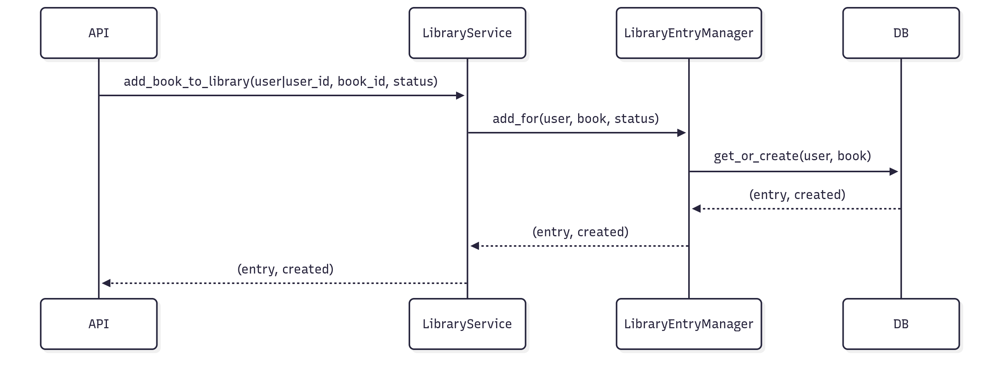
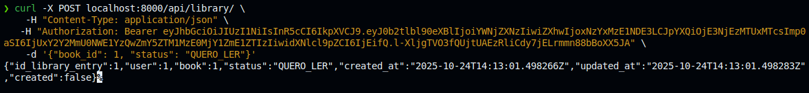

# 3.2.2. Facade

## Introdução

O Facade é um padrão estrutural que fornece uma interface simples para um conjunto de operações complexas em subsistemas. No [UC13](https://unbarqdsw2025-2-turma01.github.io/2025.2-T01-G5_EuRecomendo_Entrega_02/#/Modelagem/2.3.1.CasosDeUso?id=tabela-13-especifica%c3%a7%c3%a3o-caso-de-uso-13-adicionar-livro-%c3%a0-biblioteca-pessoal), utilizamos um serviço de aplicação para concentrar validações, transações e orquestração da criação idempotente de `LibraryEntry`.

## Objetivo

- Fornecer um ponto único para a API invocar a operação “adicionar livro à biblioteca pessoal”.
- Esconder detalhes de busca de entidades, transações e reuso do Factory Method.
- Facilitar testes e manutenibilidade ao concentrar regras em um serviço.


## Vantagens

- Interface única e coesa para o caso de uso.
- Menor acoplamento entre a API e detalhes de persistência/regra.
- Reaproveita o Manager (Factory Method) e adiciona transação.


## Desvantagens

- Mais uma camada lógica para manter.
- Se sobrecarregado, pode virar um “Deus” de regras — manter coeso.


## Metodologia

Para a realização deste projeto, adotamos uma abordagem estruturada, utilizando um conjunto de ferramentas e tecnologias para o desenvolvimento, documentação e validação do padrão Facade. Abaixo estão listadas as ferramentas empregadas e suas respectivas finalidades:

- **Mermaid**: Utilizado para a criação dos diagramas que ilustram a estrutura do padrão, facilitando a visualização das relações entre classes e interfaces.
- **Visual Studio Code (VSCode)**: Empregado como ambiente de desenvolvimento integrado (IDE) para a escrita, edição e depuração do código-fonte.
- **YouTube**: Utilizado para gravar e compartilhar vídeos demonstrando o funcionamento do código implementado, permitindo a validação visual dos resultados.
- **Docsify**: Ferramenta usada para o desenvolvimento e geração da documentação do projeto, garantindo uma apresentação clara e acessível do conteúdo.
- **Django**: Framework principal utilizado para o desenvolvimento, estruturando o projeto;
- **Python**: Linguagem de programação adotada.

O desenvolvimento seguiu uma abordagem iterativa, iniciando com o estudo aprofundado do padrão Facade por meio das referências bibliográficas: *Refactoring Guru (Facade), Django Transactions* . Essas fontes foram fundamentais para compreender os conceitos teóricos do padrão, suas aplicações práticas e melhores práticas de implementação, orientando a elaboração dos diagramas e a implementação do código, além da redação do documento. A documentação foi desenvolvida em conjunto e em paralelo, consolidando os aprendizados teóricos e práticos. Os resultados foram validados por meio de testes e gravações no YouTube, garantindo a correta aplicação do padrão.

## Diagramas

<font size="2"><p style="text-align: center"><b>Figura 1:</b> Diagrama Facade</div>

<div style="text-align: center;">



</div>

<font size="2"><p style="text-align: center"><b>Autores:</b> [Euller Júlio](https://www.github.com/Potatoyz908) e [Gabriel Castelo](https://github.com/GabrielCastelo-31), 2025</p></font>


## Código

Foram implementados os códigos no padrão Facade. Seguem abaixo:

```python
# backend/library/services.py
class LibraryService:
    @staticmethod
    @transaction.atomic
    def add_book_to_library(*, user=None, user_id=None, book_id, status="QUERO_LER"):
        User = get_user_model()
        if user is None:
            if user_id is None:
                raise ValueError("user ou user_id deve ser informado")
            user = User.objects.get(id=user_id)
        book = Book.objects.get(id=book_id)
        entry, created = LibraryEntry.objects.add_for(user=user, book=book, status=status)
        return entry, created
```


<font size="2"><p style="text-align: center"><b>Autor/es:</b>[Euller Júlio](https://www.github.com/Potatoyz908) e [Gabriel Castelo](https://github.com/GabrielCastelo-31), 2025</p></font>

## Resultados do Código

- POST `/api/library/` com `{ "book_id": 1, "status": "QUERO_LER" }` → (entry, created)
- Controle transacional evita inconsistências em falhas intermediárias.

<font size="2"><p style="text-align: center"><b>Figura 2:</b>Resultado da execução</div>

<div style="text-align: center;">



</div>

<font size="2"><p style="text-align: center"><b>Autores:</b> [Euller Júlio](https://www.github.com/Potatoyz908) e [Gabriel Castelo](https://github.com/GabrielCastelo-31), 2025</p></font>

## Passo a Passo para Rodar os Códigos

1) Subir e preparar o ambiente

```bash
cd backend
docker compose up --build -d
docker compose exec web python manage.py migrate
docker compose exec web python manage.py createsuperuser
```

2) Obter token JWT (curl)

```bash
curl -X POST {{base_url}}/api/token/ \
    -H 'Content-Type: application/json' \
    -d '{"username":"admin","password":"<sua_senha>"}'
```

Resposta:

```json
{ "access": "<access_token>", "refresh": "<refresh_token>" }
```

3) Criar Book (autenticado)

```bash
curl -X POST {{base_url}}/api/books/ \
    -H "Content-Type: application/json" \
    -H "Authorization: Bearer <access_token>" \
    -d '{"title":"Clean Code","author":"Robert C. Martin"}'
```

4) Adicionar Book à Library ([UC13] (https://unbarqdsw2025-2-turma01.github.io/2025.2-T01-G5_EuRecomendo_Entrega_02/#/Modelagem/2.3.1.CasosDeUso?id=tabela-13-especifica%c3%a7%c3%a3o-caso-de-uso-13-adicionar-livro-%c3%a0-biblioteca-pessoal))

```bash
curl -X POST {{base_url}}/api/library/ \
    -H "Content-Type: application/json" \
    -H "Authorization: Bearer <access_token>" \
    -d '{"book_id": 1, "status": "QUERO_LER"}'
```

No Postman: execute na ordem — `Auth → Obtain Token`, `Books → Create Book`, `Library → Add Book to Library (UC13)` (a coleção salva tokens automaticamente).


## Vídeo

<font size="2"><p style="text-align: center">Vídeo 1 - Execução Facade</p></font>

<center>
<iframe width="560" height="315" src="https://www.youtube.com/embed/I-G8wGajKzc?si=r9YJAQEYp7EOGBIx" title="YouTube video player" frameborder="0" allow="accelerometer; autoplay; clipboard-write; encrypted-media; gyroscope; picture-in-picture; web-share" referrerpolicy="strict-origin-when-cross-origin" allowfullscreen></iframe>
</center>

<font size="2"><p style="text-align: center">Autor: [Euller Júlio](https://github.com/Potatoyz908), 2025.</p></font>

## Bibliografia

> [1] Django Transactions: https://docs.djangoproject.com/en/stable/topics/db/transactions/

> [2] Refactoring Guru. (s.d.). _Facade_. Disponível em: <https://refactoring.guru/design-patterns/facade>.


### Histórico de Versões

| Versão | Data       | Descrição                                                                    | Autor(es)                                                                                        | Revisor(es)                                   | Detalhes da Revisão |
| ------ | ---------- | ---------------------------------------------------------------------------- | ------------------------------------------------------------------------------------------------ | --------------------------------------------- | ------------------- |
| 0.1    | 21/10/2025 | Criação inicial do documento                      | [Sophia Silva](https://github.com/sophiassilva) | [Renan Vieira]() |                     |
| 1.0    | 19/10/2025 | Adição dos códigos e diagrama base  | [Euller Júlio](https://www.github.com/Potatoyz908) e [Gabriel Castelo](https://github.com/GabrielCastelo-31)| [Sophia Silva](https://github.com/sophiassilva)          |
| 1.1    | 22/10/2025 | Adicionado o vídeo da demonstração do código | [Euller Júlio](https://www.github.com/Potatoyz908)| [Gabriel Castelo](https://github.com/GabrielCastelo-31) | Necessário alterar link do Drive para o youtube                    |
| 1.2    | 24/10/2025 | Revisão geral, melhorias no documento e adição do link para youtube | [Gabriel Castelo](https://github.com/GabrielCastelo-31) | [Euller Júlio](https://www.github.com/Potatoyz908) |                     |

