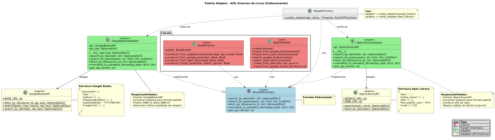

# 3.2.3. Adapter

## Introdução

O Adapter é um padrão estrutural que permite que interfaces incompatíveis trabalhem juntas, atuando como um "tradutor" entre duas interfaces que não podem se comunicar diretamente. Na aplicação "EuRecomendo", aplicamos este padrão para:

**1. Primeira Aplicação**  Criar uma interface unificada para integração com múltiplas APIs externas de livros: Google Books API e Open Library API. O padrão é implementado através da interface `BookAPIInterface` e classes adaptadoras específicas para cada API (`GoogleBooksAdapter` e `OpenLibraryAdapter`).

Vale ressaltar que o padrão Adapter é normalmente usado quando:
- Você precisa usar uma classe existente, mas sua interface não corresponde à que você precisa;
- Deseja criar uma classe reutilizável que coopera com classes não relacionadas ou não previstas;
- Precisa usar várias subclasses existentes, mas é impraticável adaptar suas interfaces criando subclasses;
- Quer facilitar a adição de novas integrações sem modificar código existente.

## Objetivo

Para a nossa *primeira* aplicação do padrão:
- Desacoplar a lógica de negócio das especificidades de cada API externa.
- Fornecer interface comum (`BookAPIInterface`) para diferentes fontes de dados.
- Normalizar estruturas de dados heterogêneas em formato padrão.
- Facilitar adição de novas APIs sem modificar código cliente.
- Seguir o princípio Open/Closed (aberto para extensão, fechado para modificação).


## Vantagens

Para a nossa *primeira* aplicação do padrão:
- **Separação de responsabilidades**: Cada adapter se concentra em traduzir uma API específica.
- **Reutilização de código**: Director usa um único método para todas as APIs.
- **Extensibilidade**: Adicionar nova API requer apenas criar novo adapter.
- **Testabilidade**: Fácil mockar adapters em testes unitários.
- **Princípios SOLID**: Segue Open/Closed e Dependency Inversion Principles.


## Desvantagens

Para a nossa *primeira* aplicação do padrão:
- **Complexidade adicional**: Introduz camada extra de abstração.
- **Overhead inicial**: Requer criação de múltiplas classes (interface + adapters).
- **Curva de aprendizado**: Novos desenvolvedores (a gente rs) precisam entender a arquitetura. 


## Metodologia

Para a realização deste projeto, adotamos uma abordagem estruturada, utilizando um conjunto de ferramentas e tecnologias para o desenvolvimento, documentação e validação do padrão adapter. Abaixo estão listadas as ferramentas empregadas e suas respectivas finalidades:


Para a nossa *primeira* aplicação do padrão:
- **Ferramentas**: VS Code, Django/DRF (implementação), PostgreSQL (persistência), Docker (execução), Postman (testes de API), pytest/Django TestCase (testes unitários).
- **APIs externas**: Google Books API (https://www.googleapis.com/books/v1/volumes), Open Library API (https://openlibrary.org/api).

**Referências**
- Gamma, E. et al. **Design Patterns: Elements of Reusable Object-Oriented Software**. Addison-Wesley, 1995.
- Refactoring Guru - Adapter Pattern: https://refactoring.guru/design-patterns/adapter
- Google Books API Documentation: https://developers.google.com/books/docs/v1/using
- Open Library API Documentation: https://openlibrary.org/developers/api
- Django REST Framework: https://www.django-rest-framework.org/

O desenvolvimento seguiu uma abordagem iterativa, iniciando com o estudo aprofundado do padrão Adapter por meio das referências bibliográficas citadas acima. Essas fontes foram fundamentais para compreender os conceitos teóricos do padrão, suas aplicações práticas e melhores práticas de implementação, orientando a elaboração dos diagramas e a implementação do código, além da redação do documento. A documentação foi desenvolvida em conjunto e em paralelo, consolidando os aprendizados teóricos e práticos. Os resultados foram validados por meio de testes e gravações no YouTube, garantindo a correta aplicação do padrão.

## Para a *primeira* aplicação
### Diagramas

<font size="2"><p style="text-align: center"><b>Figura 1:</b> Diagrama Adapter Books</div>

<div style="text-align: center;">



</div>

<font size="2"><p style="text-align: center"><b>Autores:</b> Bruno e Luis, 2025</p></font>


### Código

A interface comum `BookAPIInterface` define o contrato para todos os adapters:

```python
from abc import ABC, abstractmethod
from typing import Dict, List, Optional

class BookAPIInterface(ABC):
    """Interface comum para adapters de APIs de livros."""

    @abstractmethod
    def search_by_isbn(self, isbn: str) -> Optional[Dict]:
        """Busca livro por ISBN e retorna dados normalizados."""
        pass

    @abstractmethod
    def search_by_query(self, query: str, limit: int = 10) -> List[Dict]:
        """Busca livros por query e retorna lista de dados normalizados."""
        pass

    @abstractmethod
    def fetch_by_id(self, volume_id: str) -> Optional[Dict]:
        """Busca livro por ID específico da API."""
        pass

    @abstractmethod
    def normalize_to_standard_format(self, api_data: dict) -> Dict:
        """Normaliza dados da API para formato padrão."""
        pass

    @abstractmethod
    def get_api_name(self) -> str:
        """Retorna nome da API."""
        pass
```

#### GoogleBooksAdapter (backend/books/adapters.py)
Adapter para a Google Books API:

```python
class GoogleBooksAdapter(BookAPIInterface):
    """Adapter para Google Books API."""

    def __init__(self, api_key: str = None):
        self.api_key = api_key
        self.api = GoogleBooksAPI(api_key=api_key)

    def search_by_isbn(self, isbn: str) -> Optional[Dict]:
        """Busca por ISBN no Google Books."""
        api_data = self.api.search_by_isbn(isbn)
        if not api_data:
            return None
        return self.normalize_to_standard_format(api_data)

    def search_by_query(self, query: str, limit: int = 10) -> List[Dict]:
        """Busca por query no Google Books."""
        results = self.api.search(query, max_results=limit)
        items = results.get('items', [])
        return [self.normalize_to_standard_format(item) for item in items]

    def fetch_by_id(self, volume_id: str) -> Optional[Dict]:
        """Busca por ID do volume."""
        api_data = self.api.fetch_by_id(volume_id)
        if not api_data:
            return None
        return self.normalize_to_standard_format(api_data)

    def normalize_to_standard_format(self, api_data: dict) -> Dict:
        """Normaliza dados do Google Books para formato padrão."""
        volume_info = api_data.get('volumeInfo', {})

        # Extrai ISBN (preferência para ISBN-13)
        isbn = None
        identifiers = volume_info.get('industryIdentifiers', [])
        for identifier in identifiers:
            if identifier.get('type') == 'ISBN_13':
                isbn = identifier.get('identifier')
                break
        if not isbn:
            for identifier in identifiers:
                if identifier.get('type') == 'ISBN_10':
                    isbn = identifier.get('identifier')
                    break

        # Extrai ano de publicação
        published_date = volume_info.get('publishedDate', '')
        publication_year = None
        if published_date:
            try:
                publication_year = int(published_date[:4])
            except (ValueError, IndexError):
                pass

        # Monta dados normalizados
        return {
            'title': volume_info.get('title', ''),
            'authors': volume_info.get('authors', []),
            'isbn': isbn,
            'publisher': volume_info.get('publisher', ''),
            'published_date': published_date,
            'publication_year': publication_year,
            'description': volume_info.get('description', ''),
            'cover_url': volume_info.get('imageLinks', {}).get('thumbnail', ''),
            'page_count': volume_info.get('pageCount'),
            'language': volume_info.get('language', 'pt-BR'),
            'categories': volume_info.get('categories', []),
            'average_rating': volume_info.get('averageRating'),
        }

    def get_api_name(self) -> str:
        return 'google_books'
```

#### OpenLibraryAdapter (backend/books/adapters.py)
Adapter para a Open Library API:

```python
class OpenLibraryAdapter(BookAPIInterface):
    """Adapter para Open Library API."""

    def __init__(self):
        self.api = OpenLibraryAPI()

    def search_by_isbn(self, isbn: str) -> Optional[Dict]:
        """Busca por ISBN no Open Library."""
        api_data = self.api.fetch_by_isbn(isbn)
        if not api_data:
            return None
        return self.normalize_to_standard_format(api_data)

    def search_by_query(self, query: str, limit: int = 10) -> List[Dict]:
        """Busca por query no Open Library."""
        results = self.api.search(query, limit=limit)
        docs = results.get('docs', [])
        return [self.normalize_to_standard_format(doc) for doc in docs]

    def fetch_by_id(self, volume_id: str) -> Optional[Dict]:
        """Open Library não suporta fetch por ID genérico."""
        return None

    def normalize_to_standard_format(self, api_data: dict) -> Dict:
        """Normaliza dados do Open Library para formato padrão."""
        # Seleciona o ISBN mais longo (prioriza ISBN-13)
        isbns = api_data.get('isbn', [])
        isbn = max(isbns, key=len) if isbns else None

        # Extrai ano
        publish_year = api_data.get('first_publish_year')

        # Constrói URL da capa
        cover_id = api_data.get('cover_i')
        cover_url = f"https://covers.openlibrary.org/b/id/{cover_id}-L.jpg" if cover_id else ''

        # Mapeamento de códigos de idioma
        languages = api_data.get('language', [])
        language = languages[0] if languages else 'en'

        return {
            'title': api_data.get('title', ''),
            'authors': api_data.get('author_name', []),
            'isbn': isbn,
            'publisher': api_data.get('publisher', [''])[0] if api_data.get('publisher') else '',
            'published_date': str(publish_year) if publish_year else '',
            'publication_year': publish_year,
            'description': '',  # Open Library search não retorna descrição
            'cover_url': cover_url,
            'page_count': api_data.get('number_of_pages_median'),
            'language': language,
            'categories': api_data.get('subject', [])[:3],  # Limita a 3 categorias
            'average_rating': None,  # Open Library não fornece rating na busca
        }

    def get_api_name(self) -> str:
        return 'open_library'
```

#### Integração com BookDirector (backend/books/builders.py)
O Director usa adapters através de método unificado:

```python
class BookDirector:
    def __init__(self):
        self.builder = BookBuilder()

    def construct_from_adapter(self, normalized_data: dict, api_name: str) -> Book:
        """Constrói livro a partir de dados normalizados de qualquer adapter."""
        self.builder.reset()

        # Título (obrigatório)
        if not normalized_data.get('title'):
            raise ValueError(f"{api_name} retornou livro sem título")
        self.builder.set_title(normalized_data['title'])

        # Autores
        authors = normalized_data.get('authors', [])
        if authors:
            self.builder.set_author(', '.join(authors))
        else:
            self.builder.set_author('Autor Desconhecido')

        # Campos opcionais
        if normalized_data.get('isbn'):
            self.builder.set_isbn(normalized_data['isbn'])

        if normalized_data.get('publication_year'):
            self.builder.set_publication_year(normalized_data['publication_year'])

        if normalized_data.get('publisher'):
            self.builder.set_publisher(normalized_data['publisher'])

        if normalized_data.get('description'):
            self.builder.set_description(normalized_data['description'])

        if normalized_data.get('cover_url'):
            self.builder.set_cover_url(normalized_data['cover_url'])

        if normalized_data.get('page_count'):
            self.builder.set_page_count(normalized_data['page_count'])

        if normalized_data.get('language'):
            self.builder.set_language(normalized_data['language'])

        if normalized_data.get('categories'):
            categories = normalized_data['categories']
            self.builder.set_genre(categories[0] if categories else '')
            self.builder.set_categories(categories)

        if normalized_data.get('average_rating'):
            self.builder.set_average_rating(normalized_data['average_rating'])

        self.builder.set_source(api_name)
        return self.builder.build()
```

#### Factory Method (backend/books/adapters.py)
Função factory para criação dinâmica de adapters:

```python
def create_adapter(api_name: str, **kwargs) -> BookAPIInterface:
    """Factory para criar adapters dinamicamente."""
    adapters = {
        'google_books': GoogleBooksAdapter,
        'open_library': OpenLibraryAdapter,
    }

    if api_name not in adapters:
        raise ValueError(f"API desconhecida: {api_name}")

    return adapters[api_name](**kwargs)
```

<font size="2"><p style="text-align: center"><b>Autores:</b> Bruno e Luis, 2025</p></font>

### Resultados do Código

#### 1. Importação via Google Books Adapter
```bash
POST /api/books/
{
  "google_books_id": "hjEFCAAAQBAJ"
}
```

Resposta: **201 CREATED**
```json
{
  "id": 1,
  "title": "Clean Code: A Handbook of Agile Software Craftsmanship",
  "author": "Robert C. Martin",
  "isbn": "9780132350884",
  "publisher": "Prentice Hall",
  "publication_year": 2008,
  "description": "Even bad code can function...",
  "cover_url": "https://books.google.com/books/content?id=...",
  "page_count": 464,
  "language": "en",
  "categories": ["Computers"],
  "average_rating": 4.5,
  "source": "google_books",
  "created_at": "2025-10-23T10:30:00Z"
}
```

#### 2. Importação via Open Library Adapter
```bash
POST /api/books/import-open-library/
{
  "isbn": "0451524934"
}
```

Resposta: **201 CREATED**
```json
{
  "id": 2,
  "title": "1984",
  "author": "George Orwell",
  "isbn": "0451524934",
  "publisher": "Signet Classic",
  "publication_year": 1949,
  "cover_url": "https://covers.openlibrary.org/b/id/...",
  "source": "open_library",
  "created_at": "2025-10-23T10:35:00Z"
}
```

#### 3. Busca no Open Library (sem criar)
```bash
GET /api/books/search-open-library/?q=1984+orwell
```

Resposta: **200 OK**
```json
{
  "count": 10,
  "api_source": "open_library",
  "results": [
    {
      "title": "1984",
      "authors": ["George Orwell"],
      "isbn": "0451524934",
      "publication_year": 1949
    }
  ]
}
```

#### 4. Uso do Factory Pattern
```python
# Criação dinâmica de adapter
from books.adapters import create_adapter

adapter = create_adapter('google_books', api_key='YOUR_KEY')
results = adapter.search_by_query('clean code', limit=10)

# Trocar para Open Library sem modificar código cliente
adapter = create_adapter('open_library')
results = adapter.search_by_query('clean code', limit=10)
```

### Passo a Passo para Rodar os Códigos

Primeiro deve-se entrar na branch `feat-Adapter_luis_e_bruno`

#### 1. Subir containers Docker
```bash
cd backend
docker compose up --build -d
```

Verificar containers:
```bash
docker compose ps
```

Esperado: `backend-web-1` (Django) e `backend-db-1` (PostgreSQL) rodando.

#### 2. Aplicar migrações
```bash
docker compose exec web python manage.py makemigrations books
docker compose exec web python manage.py migrate
```

#### 3. Criar superusuário
```bash
docker compose exec web python manage.py createsuperuser
```

Exemplo:
- Username: `admin`
- Password: `admin123`

#### 4. Obter token JWT
```bash
curl -X POST http://localhost:8001/api/token/ \
  -H "Content-Type: application/json" \
  -d '{"username":"admin","password":"admin123"}'
```

Resposta:
```json
{
  "access": "<access_token>",
  "refresh": "<refresh_token>"
}
```

#### 5. Testar importação do Google Books
```bash
TOKEN="<access_token>"

curl -X POST http://localhost:8001/api/books/ \
  -H "Content-Type: application/json" \
  -H "Authorization: Bearer $TOKEN" \
  -d '{"google_books_id": "hjEFCAAAQBAJ"}'
```

#### 6. Testar importação do Open Library
```bash
curl -X POST http://localhost:8001/api/books/import-open-library/ \
  -H "Content-Type: application/json" \
  -H "Authorization: Bearer $TOKEN" \
  -d '{"isbn": "0451524934"}'
```

#### 7. Buscar no Open Library (sem criar)
```bash
curl "http://localhost:8001/api/books/search-open-library/?q=1984+orwell"
```

#### 8. Executar testes
```bash
docker compose exec web python manage.py test books.tests.GoogleBooksAdapterTestCase
docker compose exec web python manage.py test books.tests.OpenLibraryAdapterTestCase
docker compose exec web python manage.py test books.tests.AdapterFactoryTestCase
```

#### 9. Verificar no Django Admin
1. Acessar: http://localhost:8001/admin
2. Login: `admin` / `admin123`
3. Navegar para **Books**
4. Verificar livros com campo **Source** (google_books ou open_library)

### Vídeo

<font size="2"><p style="text-align: center">Vídeo 1 - Adapter.</p></font>

<center>
Insira o frame aqui
</center>

<font size="2"><p style="text-align: center">Autor/es: [](), 2025.</p></font>


## Para a *segunda* aplicação
### Diagramas

<font size="2"><p style="text-align: center"><b>Figura 1:</b> Nome</div>

<div style="text-align: center;">


</div>

<font size="2"><p style="text-align: center"><b>Autores:</b> Nomes, 2025</p></font>

<font size="2"><p style="text-align: center"><b>Figura N:</b> Nome</div>

<div style="text-align: center;">


</div>

<font size="2"><p style="text-align: center"><b>Autor/es:</b> Nomes, 2025</p></font>

### Código

Foram implementados os códigos no padrão X. Seguem abaixo:


<font size="2"><p style="text-align: center"><b>Autor/es:</b> Nomes, 2025</p></font>

### Resultados do Código

<div style="text-align: center;">


</div>

<font size="2"><p style="text-align: center"><b>Autor/es:</b> Nomes, 2025</p></font>

### Passo a Passo para Rodar os Códigos

1. Entre na branch x ...


### Vídeo

<font size="2"><p style="text-align: center">Vídeo 1 - Adapter.</p></font>

<center>
Insira o frame aqui
</center>

<font size="2"><p style="text-align: center">Autor/es: [](), 2025.</p></font>

## Bibliografia

- Gamma, E. et al. **Design Patterns: Elements of Reusable Object-Oriented Software**. Addison-Wesley, 1995.
- Refactoring Guru - Adapter Pattern: https://refactoring.guru/design-patterns/adapter
- Google Books API Documentation: https://developers.google.com/books/docs/v1/using
- Open Library API Documentation: https://openlibrary.org/developers/api
- Django REST Framework: https://www.django-rest-framework.org/


### Histórico de Versões

| Versão | Data       | Descrição                                                                    | Autor(es)                                                                                        | Revisor(es)                                   | Detalhes da Revisão |
| ------ | ---------- | ---------------------------------------------------------------------------- | ------------------------------------------------------------------------------------------------ | --------------------------------------------- | ------------------- |
| 0.1    | 24/10/2025 | Criação inicial do documento seguindo padrão do Builder                      | [Bruno Reis](https://github.com/BrunoBReis) e [Luis Lima](https://github.com/luishenriquelima) |  |                     |
| 0.2    | 24/10/2025 | Criação inicial do documento seguindo padrão do Builder                      | [Bruno Reis](https://github.com/BrunoBReis) e [Luis Lima](https://github.com/Luidooo) |  |                     |
