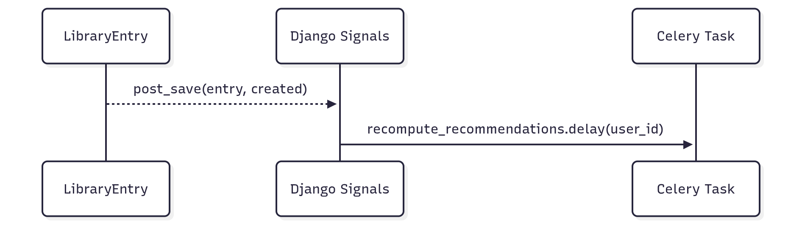

# 3.3.1. Observer

## Introdução

Observer é um padrão comportamental no qual objetos (Observers) são notificados sobre mudanças ocorridas em outro objeto (Subject). No UC13, o `LibraryEntry` atua como Subject: ao salvar, um Signal `post_save` notifica um handler que enfileira uma task Celery para atualizar recomendações.

## Objetivo

- Desacoplar a API dos efeitos assíncronos (ex.: recomputar recomendações).
- Permitir extensão futura adicionando/removendo handlers sem modificar a lógica central.


## Vantagens

- Baixo acoplamento entre a camada de gravação e efeitos colaterais.
- Extensibilidade: múltiplos handlers podem ouvir o mesmo evento.
- Testabilidade: é possível mockar/espionar handlers.


## Desvantagens

- Fluxo implícito (event-driven) pode dificultar rastreabilidade.
- Em ambientes sem Celery/broker, handler precisa ser resiliente (tratado no código).

## Metodologia

Para a realização deste projeto, adotamos uma abordagem estruturada, utilizando um conjunto de ferramentas e tecnologias para o desenvolvimento, documentação e validação do padrão X. Abaixo estão listadas as ferramentas empregadas e suas respectivas finalidades:

- **Mermaid**: Utilizado para a criação dos diagramas que ilustram a estrutura do padrão, facilitando a visualização das relações entre classes e interfaces.
- **Visual Studio Code (VSCode)**: Empregado como ambiente de desenvolvimento integrado (IDE) para a escrita, edição e depuração do código-fonte.
- **YouTube**: Utilizado compartilhar vídeos demonstrando o funcionamento do código implementado, permitindo a validação visual dos resultados.
- **Docsify**: Ferramenta usada para o desenvolvimento e geração da documentação do projeto, garantindo uma apresentação clara e acessível do conteúdo.
- **Django**: Framework principal utilizado para o desenvolvimento, estruturando o projeto;
- **Python**: Linguagem de programação adotada.
- **Celery**: Utilizado para o gerenciamento de tarefas assíncronas, permitindo a execução de processos em segundo plano.
- **Django** Signals: Utilizado para implementar o padrão Observer, permitindo a notificação de eventos dentro do framework Django.

- **Referências**: Django Signals, patterns comportamentais.


## Diagramas

<font size="2"><p style="text-align: center"><b>Figura 1:</b> Diagrama Observer</div>

<div style="text-align: center;">



</div>

<font size="2"><p style="text-align: center"><b>Autores:</b> [Euller Júlio](https://www.github.com/Potatoyz908) e [Gabriel Castelo](https://github.com/GabrielCastelo-31), 2025</p></font>


## Código

Foram implementados os códigos no padrão Observer. Seguem abaixo:

```python
# backend/library/signals.py
@receiver(post_save, sender=LibraryEntry)
def library_entry_post_save(sender, instance: LibraryEntry, created, **kwargs):
    if recompute_recommendations is not None:
        try:
            recompute_recommendations.delay(user_id=instance.user_id)
        except Exception:
            pass

# backend/celery_app/tasks.py
@shared_task
def recompute_recommendations(user_id: int):
    return {"user_id": user_id, "status": "recomputed"}
```

<font size="2"><p style="text-align: center"><b>Autor:</b> [Euller Júlio](https://github.com/Potatoyz908), 2025</p></font>

## Resultados do Código

- Ao executar POST `/api/library/`, a criação/atualização do `LibraryEntry` dispara o `post_save` e agenda a task Celery para o `user_id` do vínculo.

## Passo a Passo para Rodar os Códigos

1) Subir e preparar ambiente

```bash
cd backend
docker compose up --build -d
docker compose exec web python manage.py migrate
docker compose exec web python manage.py createsuperuser
```

2) Obter token JWT (curl)

```bash
curl -X POST {{base_url}}/api/token/ \
    -H 'Content-Type: application/json' \
    -d '{"username":"admin","password":"<sua_senha>"}'
```

3) Criar Book (autenticado)

```bash
curl -X POST {{base_url}}/api/books/ \
    -H "Content-Type: application/json" \
    -H "Authorization: Bearer <access_token>" \
    -d '{"title":"Clean Code","author":"Robert C. Martin"}'
```

4) POST na Library (UC13)

```bash
curl -X POST {{base_url}}/api/library/ \
    -H "Content-Type: application/json" \
    -H "Authorization: Bearer <access_token>" \
    -d '{"book_id": 1, "status": "QUERO_LER"}'
```

5) Validar side-effect (Celery)

- Se o worker Celery estiver configurado (Redis + worker), verifique logs do worker para a execução de `recompute_recommendations`.
- Em ambiente sem worker, o signal tenta chamar a task mas falha silenciosamente (por design, para não quebrar a API em dev).

No Postman: execute `Auth → Obtain Token` antes das requests autenticadas e confira as variáveis `access_token` e `refresh_token`.


## Vídeo

<font size="2"><p style="text-align: center">Vídeo 1 - Observer.</p></font>

<center>
Insira o frame aqui
</center>

<font size="2"><p style="text-align: center">Autor/es: [](), 2025.</p></font>

## Bibliografia

> [1] Gamma, E., Helm, R., Johnson, R., & Vlissides, J. (1995). _Design Patterns: Elements of Reusable Object-Oriented Software_. Addison-Wesley.

> [2] Refactoring Guru. (s.d.). _Observer_. Disponível em: <https://refactoring.guru/design-patterns/observer>.

> [3] - Django — Signals: https://docs.djangoproject.com/en/stable/topics/signals/


### Histórico de Versões

| Versão | Data       | Descrição                                                                    | Autor(es)                                                                                        | Revisor(es)                                   | Detalhes da Revisão |
| ------ | ---------- | ---------------------------------------------------------------------------- | ------------------------------------------------------------------------------------------------ | --------------------------------------------- | ------------------- |
| 0.1    | 21/10/2025 | Criação inicial do documento                      | [Sophia Silva](https://github.com/sophiassilva) | [Renan Vieira]() |                     |
| 1.0    | 29/10/2025 | Adição de introduao, diagrama, código, resultados e passo a passo do Observer | [Euller Júlio](https://www.github.com/Potatoyz908), [Gabriel Castelo](https://github.com/GabrielCastelo-31) | [Sophia Silva](https://github.com/sophiassilva) |                     |
| 1.1    | 19/11/2025 | Ajustes na formatação e correções gerais no documento |[Gabriel Castelo](https://github.com/GabrielCastelo-31) | [Euller Júlio](https://www.github.com/Potatoyz908) |                     |
