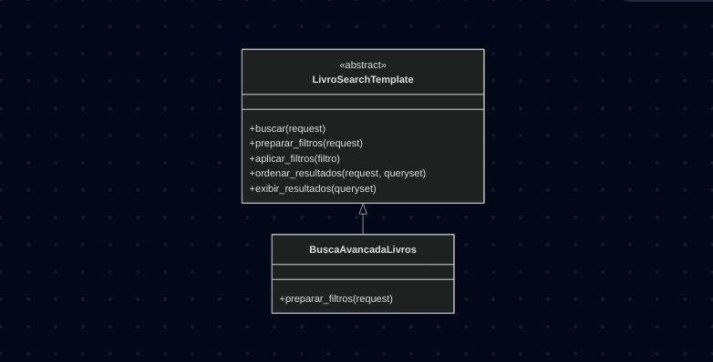

# 3.3.3. Template Method

## Introdução

O Template Method é um padrão de projeto comportamental que define o esqueleto de um algoritmo na superclasse mas deixa as subclasses sobrescreverem etapas específicas do algoritmo sem modificar sua estrutura. O padrão do Template Method sugere que você quebre um algoritmo em uma série de etapas, transforme essas etapas em métodos, e coloque uma série de chamadas para esses métodos dentro de um único método padrão.

- ...

## Objetivo

O Template Method permite que você transforme um algoritmo monolítico em uma série de etapas individuais que podem facilmente ser estendidas por subclasses enquanto ainda mantém intacta a estrutura definida em uma superclasse.

## Vantagens

O uso do template method oferece diversos benefícios, incluindo:

- Deixar clientes sobrescrever apenas certas partes de um algoritmo grande, tornando-os menos afetados por mudanças que acontece por outras partes do algoritmo;
- Você pode elevar o código duplicado para uma superclasse.

## Desvantagens

Apesar de suas vantagens, o template method também apresenta algumas limitações:

- Alguns clientes podem ser limitados ao fornecer o esqueleto de um algoritmo;
- Implementações tendem a ser mais difíceis de se manter quanto mais etapas eles tiverem.


## Metodologia

Para a realização deste projeto, adotamos uma abordagem estruturada, utilizando um conjunto de ferramentas e tecnologias para o desenvolvimento:

- **Mermaid**: Utilizado para a criação dos diagramas que ilustram a estrutura do padrão, facilitando a visualização das relações entre classes e interfaces.
- **Visual Studio Code (VSCode)**: Empregado como ambiente de desenvolvimento integrado (IDE) para a escrita, edição e depuração do código-fonte.
- **YouTube**: Utilizado para gravar e compartilhar vídeos demonstrando o funcionamento do código implementado, permitindo a validação visual dos resultados.
- **Docsify**: Ferramenta usada para o desenvolvimento e geração da documentação do projeto, garantindo uma apresentação clara e acessível do conteúdo.
- **Django**: Framework principal utilizado para o desenvolvimento, estruturando o projeto;
- **Python**: Linguagem de programação adotada.

O desenvolvimento seguiu uma abordagem iterativa, iniciando com o estudo do padrão por meio das referências bibliográficas e a adequação ao caso de uso escolhido (Pesquisar Livro). A documentação foi desenvolvida em conjunto e em paralelo, consolidando os aprendizados. Os resultados foram validados por meio de teste de caixa-preta e vídeo no YouTube, garantindo a correta aplicação do padrão.


# Implementação 
## UC04 - [Pesquisar Livro](https://unbarqdsw2025-2-turma01.github.io/2025.2-T01-G5_EuRecomendo_Entrega_02/#/Modelagem/2.3.1.CasosDeUso)

O padrão template method foi utilizado na pesquisa de livros, implementando a pesquisa avançada com a preparação dos filtros.

### Diagrama

<font size="2"><p style="text-align: center"><b>Figura 1:</b> Diagrama LivroSearch</div>

<div style="text-align: center;">



</div>

<font size="2"><p style="text-align: center"><b>Autores:</b> Renan Vieira e Sophia Silva, 2025</p></font>

### Código

Foram implementados os códigos no padrão Template Method. Seguem abaixo:

```python
class LivroSearchTemplate(ABC):
    def buscar(self, request):
        filtro = self.preparar_filtros(request)
        queryset = self.aplicar_filtros(filtro)
        queryset = self.ordenar_resultados(request, queryset)
        return self.exibir_resultados(queryset)

    @abstractmethod
    def preparar_filtros(self, request):
        pass

    def aplicar_filtros(self, filtro):
        return filtro.aplicar(Livro.objects.all())

    def ordenar_resultados(self, request, queryset):
        ordenar_por = request.GET.get("ordenar_por")
        if ordenar_por == "titulo":
            return queryset.order_by("title")
        return queryset

    def exibir_resultados(self, queryset):
        return queryset


class BuscaAvancadaLivros(LivroSearchTemplate):
    def preparar_filtros(self, request):
        filtro = FiltroConcreto()
        autor = request.GET.get("autor")
        if autor:
            filtro = FiltroAutor(filtro, autor)
        categoria = request.GET.get("categoria")
        if categoria:
            filtro = FiltroCategoria(filtro, categoria)
        return filtro

```


<font size="2"><p style="text-align: center"><b>Autor/es:</b> Sophia Silva e Renan Vieira, 2025</p></font>

### Passo a Passo para Rodar os Códigos

Antes de tudo, certifique-se e ter o python3 e django admin instalado no seu computador.

1. Acesse a branch [Decorator - Sophia e Renan](https://github.com/UnBArqDsw2025-2-Turma01/2025.2-T01-G5_EuRecomendo_Entrega_03/tree/feat-decorator-templatemethod-sophia-renan) e faça download ou digite no terminal
```
git checkout feat-decorator-templatemethod-sophia-renan
```
2. No terminal, digite o seguinte comando para acessar a pasta 
``` 
cd gof-decorator-template/decorator
```
3. Rode as migrações com 
```python
python3 manage.py makemigrations
python3 manage.py migrate
```
4. Crie seu super usuário
```python
python3 manage.py createsuperuser
```
5. Execute o projeto com
```python
python3 manage.py runserver
```
6. Acesse o localhost no seu navegador, adicione o /admin/ no final da url e faça login com seu usuário. Adicione 3 livros novos.
7. Apague a url do admin, acesse /biblioteca/ e utilize os filtros para fazer a busca!

### Vídeo

<font size="2"><p style="text-align: center">Vídeo 1 - Template Method.</p></font>

<center>
<iframe width="560" height="315" src="https://www.youtube.com/embed/tLEc12ndrzM?si=gDgAkOyfXhBPqMM7" title="YouTube video player" frameborder="0" allow="accelerometer; autoplay; clipboard-write; encrypted-media; gyroscope; picture-in-picture; web-share" referrerpolicy="strict-origin-when-cross-origin" allowfullscreen></iframe>Insira o frame aqui 
</center>

<font size="2"><p style="text-align: center">Autor/es: [Sophia Silva](https://github.com/sophiassilva), 2025.</p></font>

## Bibliografia

> [1] Gamma, E., Helm, R., Johnson, R., & Vlissides, J. (1995). _Design Patterns: Elements of Reusable Object-Oriented Software_. Addison-Wesley.

> [2] Refactoring Guru. (s.d.). _Template Method_. Disponível em: <[https://refactoring.guru/pt-br/design-patterns/template-method](https://refactoring.guru/pt-br/design-patterns/template-method)>.


### Histórico de Versões

| Versão | Data       | Descrição                                                                    | Autor(es)                                                                                        | Revisor(es)                                   | Detalhes da Revisão |
| ------ | ---------- | ---------------------------------------------------------------------------- | ------------------------------------------------------------------------------------------------ | --------------------------------------------- | ------------------- |
| 0.1    | 21/10/2025 | Criação inicial do documento                      | [Sophia Silva](https://github.com/sophiassilva) | [Renan Vieira](https://github.com/R-enanVieira) |                     |
| 0.2    | 23/10/2025 | Adição do vídeo e código                   | [Sophia Silva](https://github.com/sophiassilva) | [Renan Vieira](https://github.com/R-enanVieira) |                     |
| 0.3    | 23/10/2025 | Desenvolvimento do template method                 | [Sophia Silva](https://github.com/sophiassilva) | [Renan Vieira](https://github.com/R-enanVieira) |                     |
| 0.4    | 23/10/2025 | Corrige referência                  | [Renan Vieira](https://github.com/R-enanVieira) | [Sophia Silva](https://github.com/sophiassilva) |                     |
