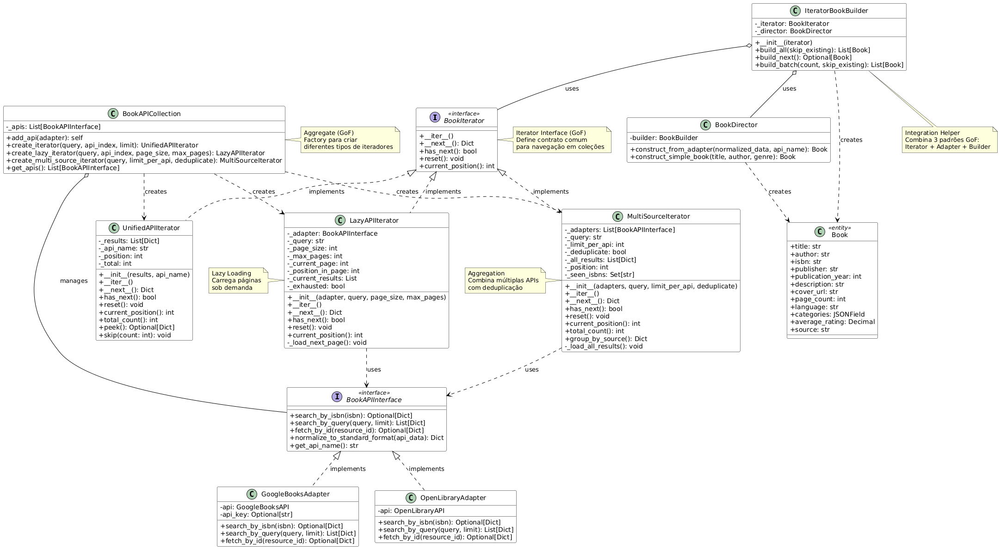

# 3.3.4. Iterator

## Introdução

O Iterator é um padrão comportamental que fornece uma maneira de acessar sequencialmente os elementos de uma coleção agregada sem expor sua representação interna. Na aplicação "EuRecomendo", aplicamos este padrão para:

**1.** Navegar de forma uniforme e eficiente pelos resultados de buscas em múltiplas APIs de livros (Google Books e Open Library). O padrão é implementado através da interface `BookIterator` e classes iteradoras específicas (`UnifiedAPIIterator`, `LazyAPIIterator` e `MultiSourceIterator`), além da classe agregadora `BookAPICollection`.

Vale ressaltar que o padrão Iterator é normalmente usado quando:
- Você precisa acessar elementos de uma coleção sem expor sua estrutura interna;
- Deseja fornecer múltiplas formas de percorrer uma coleção;
- Quer fornecer interface uniforme para percorrer diferentes estruturas de dados;
- Precisa implementar lazy loading (carregamento sob demanda) para economizar recursos.

## Objetivo

Para a nossa *primeira* aplicação do padrão:
- Fornecer interface uniforme para navegar resultados de diferentes APIs.
- Implementar lazy loading para economia de memória e requisições HTTP.
- Agregar resultados de múltiplas APIs em uma única iteração.
- Deduplicar automaticamente livros repetidos por ISBN.
- Integrar perfeitamente com os padrões Adapter e Builder já implementados.


## Vantagens

Para a nossa *primeira* aplicação do padrão:
- **Separação de responsabilidades**: Lógica de iteração isolada da lógica de negócio.
- **Lazy loading**: Carregamento sob demanda economiza memória e requisições.
- **Flexibilidade**: Múltiplos tipos de iteradores para diferentes necessidades.
- **Agregação**: Combina resultados de múltiplas APIs transparentemente.
- **Reutilização**: Iteradores podem ser reutilizados em diferentes contextos.
- **Integração**: Funciona perfeitamente com Adapter e Builder.


## Desvantagens

Para a nossa *primeira* aplicação do padrão:
- **Complexidade adicional**: Introduz camada extra de abstração para iteração simples.
- **Overhead de memória**: Alguns iteradores mantêm estado interno.
- **Curva de aprendizado**: Desenvolvedores precisam entender diferentes tipos de iteradores.


## Metodologia

Para a realização deste projeto, adotamos uma abordagem estruturada, utilizando um conjunto de ferramentas e tecnologias para o desenvolvimento, documentação e validação do padrão iterator. Abaixo estão listadas as ferramentas empregadas e suas respectivas finalidades:


Para a nossa *primeira* aplicação do padrão:
- **Ferramentas**: VS Code, Django/DRF (implementação), PostgreSQL (persistência), Docker (execução), pytest/Django TestCase (testes unitários - 30+ testes).
- **APIs externas**: Google Books API (https://www.googleapis.com/books/v1/volumes), Open Library API (https://openlibrary.org/api).
- **Padrões integrados**: Adapter (normalização de dados), Builder (criação de objetos Book).

**Referências**
- Gamma, E. et al. **Design Patterns: Elements of Reusable Object-Oriented Software**. Addison-Wesley, 1995.
- Refactoring Guru - Iterator Pattern: https://refactoring.guru/design-patterns/iterator
- Python Iterators: https://docs.python.org/3/tutorial/classes.html#iterators
- Django QuerySets: https://docs.djangoproject.com/en/stable/ref/models/querysets/

O desenvolvimento seguiu uma abordagem iterativa, iniciando com o estudo aprofundado do padrão Iterator por meio das referências bibliográficas citadas acima. A implementação integra três padrões GoF (Iterator + Adapter + Builder), demonstrando o poder da composição de padrões. Foram desenvolvidos três tipos de iteradores para atender diferentes casos de uso. A documentação foi desenvolvida em conjunto e em paralelo, consolidando os aprendizados teóricos e práticos. Os resultados foram validados por meio de 30+ testes unitários, garantindo a correta aplicação do padrão.

## Para a *primeira* aplicação
### Diagramas

<font size="2"><p style="text-align: center"><b>Figura 1:</b> Diagrama Iterator Books</div>

<div style="text-align: center;">



</div>

<font size="2"><p style="text-align: center"><b>Autores:</b> Bruno e Luis, 2025</p></font>


### Código

A interface `BookIterator` define o contrato para todos os iteradores:

```python
from abc import ABC, abstractmethod
from typing import Dict, Optional

class BookIterator(ABC):
    """Interface base para iteradores de dados de livros."""

    @abstractmethod
    def __iter__(self):
        """Retorna o próprio iterador."""
        return self

    @abstractmethod
    def __next__(self) -> Dict:
        """Retorna próximo item normalizado ou levanta StopIteration."""
        pass

    @abstractmethod
    def has_next(self) -> bool:
        """Verifica se há próximo elemento."""
        pass

    @abstractmethod
    def reset(self):
        """Reinicia o iterador para o início."""
        pass

    @abstractmethod
    def current_position(self) -> int:
        """Retorna posição atual no iterador."""
        pass
```

#### UnifiedAPIIterator (backend/books/iterators.py)
Itera sobre resultados já carregados em memória:

```python
class UnifiedAPIIterator(BookIterator):
    """Itera sobre lista de resultados normalizados já em memória."""

    def __init__(self, results: list, api_name: str):
        if results is None:
            results = []
        self._results = results
        self._api_name = api_name
        self._position = 0

    def __iter__(self):
        return self

    def __next__(self) -> Dict:
        if not self.has_next():
            raise StopIteration
        result = self._results[self._position]
        result['_api_source'] = self._api_name
        self._position += 1
        return result

    def has_next(self) -> bool:
        return self._position < len(self._results)

    def reset(self):
        """Reinicia para o início."""
        self._position = 0

    def current_position(self) -> int:
        return self._position

    def peek(self) -> Optional[Dict]:
        """Retorna próximo elemento sem avançar posição."""
        if not self.has_next():
            return None
        return self._results[self._position]

    def skip(self, count: int):
        """Pula count elementos."""
        self._position = min(self._position + count, len(self._results))

    def total_count(self) -> int:
        """Retorna total de elementos."""
        return len(self._results)

    def get_api_name(self) -> str:
        return self._api_name
```

#### LazyAPIIterator (backend/books/iterators.py)
Carrega resultados sob demanda (página por página):

```python
class LazyAPIIterator(BookIterator):
    """Itera carregando páginas de resultados sob demanda."""

    def __init__(self, adapter, query: str, page_size: int = 10, max_pages: int = 5):
        self._adapter = adapter
        self._query = query
        self._page_size = page_size
        self._max_pages = max_pages

        self._current_page = 0
        self._current_page_results = []
        self._position_in_page = 0
        self._total_position = 0
        self._finished = False

    def __iter__(self):
        return self

    def __next__(self) -> Dict:
        if not self.has_next():
            raise StopIteration

        # Se terminou página atual, carrega próxima
        if self._position_in_page >= len(self._current_page_results):
            self._load_next_page()

        if not self._current_page_results:
            raise StopIteration

        result = self._current_page_results[self._position_in_page]
        result['_api_source'] = self._adapter.get_api_name()
        self._position_in_page += 1
        self._total_position += 1
        return result

    def _load_next_page(self):
        """Carrega próxima página de resultados."""
        if self._current_page >= self._max_pages:
            self._finished = True
            return

        try:
            # Usa adapter para buscar próxima página
            results = self._adapter.search_by_query(
                self._query,
                limit=self._page_size
            )

            self._current_page_results = results
            self._current_page += 1
            self._position_in_page = 0

            if not results:
                self._finished = True
        except Exception as e:
            self._finished = True
            self._current_page_results = []

    def has_next(self) -> bool:
        if self._finished:
            return False
        if self._position_in_page < len(self._current_page_results):
            return True
        # Tenta carregar próxima página para verificar
        if self._current_page < self._max_pages:
            return True
        return False

    def reset(self):
        """Reinicia iterador."""
        self._current_page = 0
        self._current_page_results = []
        self._position_in_page = 0
        self._total_position = 0
        self._finished = False

    def current_position(self) -> int:
        return self._total_position

    def get_api_name(self) -> str:
        return self._adapter.get_api_name()
```

#### MultiSourceIterator (backend/books/iterators.py)
Agrega resultados de múltiplas APIs com deduplicação:

```python
class MultiSourceIterator(BookIterator):
    """Itera sobre resultados agregados de múltiplas APIs."""

    def __init__(self, adapters: list, query: str,
                 limit_per_api: int = 10, deduplicate_by_isbn: bool = True):
        self._adapters = adapters
        self._query = query
        self._limit_per_api = limit_per_api
        self._deduplicate = deduplicate_by_isbn

        self._all_results = []
        self._position = 0
        self._load_all_sources()

    def _load_all_sources(self):
        """Carrega resultados de todas as APIs."""
        seen_isbns = set()

        for adapter in self._adapters:
            try:
                results = adapter.search_by_query(self._query,
                                                 limit=self._limit_per_api)

                for result in results:
                    # Adiciona metadado de origem
                    result['_api_source'] = adapter.get_api_name()

                    # Deduplicação por ISBN
                    if self._deduplicate:
                        isbn = result.get('isbn')
                        if isbn and isbn in seen_isbns:
                            continue
                        if isbn:
                            seen_isbns.add(isbn)

                    self._all_results.append(result)

            except Exception as e:
                # Resiliência: continua mesmo se uma API falhar
                continue

    def __iter__(self):
        return self

    def __next__(self) -> Dict:
        if not self.has_next():
            raise StopIteration
        result = self._all_results[self._position]
        self._position += 1
        return result

    def has_next(self) -> bool:
        return self._position < len(self._all_results)

    def reset(self):
        self._position = 0

    def current_position(self) -> int:
        return self._position

    def total_count(self) -> int:
        return len(self._all_results)

    def group_by_source(self) -> dict:
        """Agrupa resultados por API de origem."""
        grouped = {}
        for result in self._all_results:
            source = result.get('_api_source', 'unknown')
            if source not in grouped:
                grouped[source] = []
            grouped[source].append(result)
        return grouped
```

#### BookAPICollection (backend/books/iterators.py)
Aggregate que gerencia APIs e cria iteradores:

```python
class BookAPICollection:
    """Aggregate que gerencia múltiplas APIs e cria iteradores."""

    def __init__(self):
        self._apis = []

    def add_api(self, adapter):
        """Adiciona API à coleção (method chaining)."""
        self._apis.append(adapter)
        return self

    def create_iterator(self, query: str, api_index: int = 0,
                       limit: int = 10) -> UnifiedAPIIterator:
        """Cria iterador unificado para uma API específica."""
        if not self._apis:
            raise ValueError("Nenhuma API adicionada à coleção")

        adapter = self._apis[api_index]
        results = adapter.search_by_query(query, limit=limit)
        return UnifiedAPIIterator(results, adapter.get_api_name())

    def create_lazy_iterator(self, query: str, api_index: int = 0,
                            page_size: int = 10,
                            max_pages: int = 5) -> LazyAPIIterator:
        """Cria iterador lazy para uma API específica."""
        if not self._apis:
            raise ValueError("Nenhuma API adicionada à coleção")

        adapter = self._apis[api_index]
        return LazyAPIIterator(adapter, query, page_size, max_pages)

    def create_multi_source_iterator(self, query: str,
                                    limit_per_api: int = 10,
                                    deduplicate: bool = True) -> MultiSourceIterator:
        """Cria iterador multi-fonte usando todas as APIs."""
        if not self._apis:
            raise ValueError("Nenhuma API adicionada à coleção")

        return MultiSourceIterator(self._apis, query,
                                  limit_per_api, deduplicate)
```

#### IteratorBookBuilder (backend/books/iterators.py)
Integração Iterator + Builder:

```python
from books.builders import BookDirector
from books.models import Book

class IteratorBookBuilder:
    """Integra Iterator com Builder para criar objetos Book."""

    def __init__(self, iterator: BookIterator):
        self._iterator = iterator
        self._director = BookDirector()

    def build_next(self) -> Optional[Book]:
        """Constrói próximo Book ou retorna None."""
        if not self._iterator.has_next():
            return None

        try:
            book_data = next(self._iterator)
            api_name = book_data.get('_api_source', 'unknown')
            return self._director.construct_from_adapter(book_data, api_name)
        except Exception as e:
            return None

    def build_all(self, skip_existing: bool = True) -> list:
        """Constrói todos os Books do iterador."""
        books = []

        for book_data in self._iterator:
            try:
                # Skip se já existe
                if skip_existing and book_data.get('isbn'):
                    if Book.objects.filter(isbn=book_data['isbn']).exists():
                        continue

                api_name = book_data.get('_api_source', 'unknown')
                book = self._director.construct_from_adapter(book_data, api_name)
                books.append(book)

            except Exception as e:
                continue

        return books

    def build_batch(self, count: int, skip_existing: bool = True) -> list:
        """Constrói número específico de Books."""
        books = []
        processed = 0

        while processed < count and self._iterator.has_next():
            try:
                book_data = next(self._iterator)

                # Skip se já existe
                if skip_existing and book_data.get('isbn'):
                    if Book.objects.filter(isbn=book_data['isbn']).exists():
                        processed += 1
                        continue

                api_name = book_data.get('_api_source', 'unknown')
                book = self._director.construct_from_adapter(book_data, api_name)
                books.append(book)
                processed += 1

            except Exception as e:
                processed += 1
                continue

        return books
```

<font size="2"><p style="text-align: center"><b>Autores:</b> Bruno e Luis, 2025</p></font>

### Resultados do Código

#### 1. Uso do UnifiedAPIIterator
```python
from books.adapters import GoogleBooksAdapter
from books.iterators import UnifiedAPIIterator

# Busca e cria iterador
adapter = GoogleBooksAdapter()
results = adapter.search_by_query("clean code", limit=10)
iterator = UnifiedAPIIterator(results, api_name='google_books')

# Navegação com controle fino
print(f"Total: {iterator.total_count()}")
next_book = iterator.peek()  # Sem avançar
print(f"Próximo: {next_book['title']}")

# Itera normalmente
for book in iterator:
    print(f"{book['title']} - {book['authors']}")
```

Saída:
```
Total: 10
Próximo: Clean Code: A Handbook of Agile Software Craftsmanship
Clean Code: A Handbook of Agile Software Craftsmanship - ['Robert C. Martin']
...
```

#### 2. Uso do LazyAPIIterator (Lazy Loading)
```python
from books.adapters import GoogleBooksAdapter
from books.iterators import LazyAPIIterator

adapter = GoogleBooksAdapter()

# Carrega sob demanda (10 por página, máx 5 páginas)
iterator = LazyAPIIterator(
    adapter,
    query="python programming",
    page_size=10,
    max_pages=5
)

# Processa apenas os 5 primeiros (economiza requisições!)
for i, book in enumerate(iterator):
    if i >= 5:
        break
    print(book['title'])
    # Próxima página só é carregada se necessário

print(f"Posição: {iterator.current_position()}")
```

Saída:
```
Python Crash Course
Learning Python
Automate the Boring Stuff with Python
Python Programming: An Introduction
Fluent Python
Posição: 5
```

#### 3. Uso do MultiSourceIterator (Agregação)
```python
from books.adapters import GoogleBooksAdapter, OpenLibraryAdapter
from books.iterators import MultiSourceIterator

# Múltiplas APIs
google = GoogleBooksAdapter()
open_lib = OpenLibraryAdapter()

# Iterador com deduplicação
iterator = MultiSourceIterator(
    adapters=[google, open_lib],
    query="1984 orwell",
    limit_per_api=10,
    deduplicate_by_isbn=True
)

# Itera sobre resultados agregados
for book in iterator:
    print(f"{book['title']} (fonte: {book['_api_source']})")

# Agrupa por fonte
grouped = iterator.group_by_source()
print(f"\nGoogle Books: {len(grouped['google_books'])}")
print(f"Open Library: {len(grouped['open_library'])}")
```

Saída:
```
1984 (fonte: google_books)
Nineteen Eighty-Four (fonte: open_library)
Animal Farm (fonte: google_books)
...

Google Books: 8
Open Library: 6
```

#### 4. Integração Iterator + Builder
```python
from books.adapters import GoogleBooksAdapter, OpenLibraryAdapter
from books.iterators import MultiSourceIterator, IteratorBookBuilder

# Cria iterador multi-fonte
google = GoogleBooksAdapter()
open_lib = OpenLibraryAdapter()

iterator = MultiSourceIterator(
    adapters=[google, open_lib],
    query="clean code",
    deduplicate_by_isbn=True
)

# Integra com Builder
builder = IteratorBookBuilder(iterator)

# Cria todos os Books de uma vez
books = builder.build_all(skip_existing=True)
print(f"✓ Criados {len(books)} livros no banco de dados")

# Verifica
for book in books:
    print(f"✓ {book.title} (ISBN: {book.isbn}, Source: {book.source})")
```

Saída:
```
✓ Criados 12 livros no banco de dados
✓ Clean Code (ISBN: 9780132350884, Source: google_books)
✓ The Pragmatic Programmer (ISBN: 9780135957059, Source: google_books)
...
```

### Passo a Passo para Rodar os Códigos

Primeiro deve-se entrar na branch `feat-iterator_luis_e_bruno`

#### 1. Subir containers Docker
```bash
cd backend
docker compose up --build -d
```

Verificar containers:
```bash
docker compose ps
```

#### 2. Aplicar migrações
```bash
docker compose exec web python manage.py makemigrations books
docker compose exec web python manage.py migrate
```

#### 3. Executar shell Django para testar iteradores
```bash
docker compose exec web python manage.py shell
```

No shell Python:
```python
from books.adapters import GoogleBooksAdapter, OpenLibraryAdapter
from books.iterators import *

# Teste 1: UnifiedAPIIterator
adapter = GoogleBooksAdapter()
results = adapter.search_by_query("clean code", limit=5)
iterator = UnifiedAPIIterator(results, 'google_books')

for book in iterator:
    print(book['title'])

# Teste 2: MultiSourceIterator + Builder
google = GoogleBooksAdapter()
open_lib = OpenLibraryAdapter()

multi = MultiSourceIterator(
    adapters=[google, open_lib],
    query="python",
    limit_per_api=10,
    deduplicate_by_isbn=True
)

builder = IteratorBookBuilder(multi)
books = builder.build_all(skip_existing=True)
print(f"Criados: {len(books)} livros")
```

#### 4. Executar testes unitários
```bash
# Todos os testes (30+)
docker compose exec web python manage.py test books.test_iterators -v 2

# Testes específicos
docker compose exec web python manage.py test books.test_iterators.UnifiedAPIIteratorTest
docker compose exec web python manage.py test books.test_iterators.LazyAPIIteratorTest
docker compose exec web python manage.py test books.test_iterators.MultiSourceIteratorTest
docker compose exec web python manage.py test books.test_iterators.BookAPICollectionTest
docker compose exec web python manage.py test books.test_iterators.IteratorBookBuilderTest
```

Saída esperada:
```
Creating test database...
test_iterator_initialization (books.test_iterators.UnifiedAPIIteratorTest) ... ok
test_iteration (books.test_iterators.UnifiedAPIIteratorTest) ... ok
test_peek (books.test_iterators.UnifiedAPIIteratorTest) ... ok
...
Ran 30 tests in 2.345s

OK
```

#### 5. Exemplo prático: Popular banco com múltiplos gêneros
Criar arquivo `populate_books.py`:

```python
from books.adapters import GoogleBooksAdapter, OpenLibraryAdapter
from books.iterators import BookAPICollection, IteratorBookBuilder
from books.models import Book

def populate_genre(genre: str):
    collection = BookAPICollection()
    collection.add_api(GoogleBooksAdapter())
    collection.add_api(OpenLibraryAdapter())

    iterator = collection.create_multi_source_iterator(
        query=genre,
        limit_per_api=15,
        deduplicate=True
    )

    builder = IteratorBookBuilder(iterator)
    books = builder.build_all(skip_existing=True)

    print(f"✓ '{genre}': {len(books)} livros importados")
    return books

# Popular múltiplos gêneros
genres = ["Python Programming", "Web Development", "Data Science"]
for genre in genres:
    populate_genre(genre)

print(f"\nTotal no banco: {Book.objects.count()} livros")
```

Executar:
```bash
docker compose exec web python populate_books.py
```

#### 6. Verificar no Django Admin
1. Acessar: http://localhost:8001/admin
2. Navegar para **Books**
3. Verificar livros de múltiplas fontes (google_books e open_library)

### Vídeo

<font size="2"><p style="text-align: center">Vídeo 1 - Iterator.</p></font>

<center>
Insira o frame aqui
</center>

<font size="2"><p style="text-align: center">Autor/es: [](), 2025.</p></font>


## Para a *segunda* aplicação
### Diagramas

<font size="2"><p style="text-align: center"><b>Figura 1:</b> Nome</div>

<div style="text-align: center;">


</div>

<font size="2"><p style="text-align: center"><b>Autores:</b> Nomes, 2025</p></font>

<font size="2"><p style="text-align: center"><b>Figura N:</b> Nome</div>

<div style="text-align: center;">


</div>

<font size="2"><p style="text-align: center"><b>Autor/es:</b> Nomes, 2025</p></font>

### Código

Foram implementados os códigos no padrão X. Seguem abaixo:


<font size="2"><p style="text-align: center"><b>Autor/es:</b> Nomes, 2025</p></font>

### Resultados do Código

<div style="text-align: center;">


</div>

<font size="2"><p style="text-align: center"><b>Autor/es:</b> Nomes, 2025</p></font>

### Passo a Passo para Rodar os Códigos

1. Entre na branch x ...


### Vídeo

<font size="2"><p style="text-align: center">Vídeo 1 - Iterator.</p></font>

<center>
Insira o frame aqui
</center>

<font size="2"><p style="text-align: center">Autor/es: [](), 2025.</p></font>

## Bibliografia

- Gamma, E. et al. **Design Patterns: Elements of Reusable Object-Oriented Software**. Addison-Wesley, 1995.
- Refactoring Guru - Iterator Pattern: https://refactoring.guru/design-patterns/iterator
- Python Iterators: https://docs.python.org/3/tutorial/classes.html#iterators
- Django QuerySets: https://docs.djangoproject.com/en/stable/ref/models/querysets/


### Histórico de Versões

| Versão | Data       | Descrição                                                                    | Autor(es)                                                                                        | Revisor(es)                                   | Detalhes da Revisão |
| ------ | ---------- | ---------------------------------------------------------------------------- | ------------------------------------------------------------------------------------------------ | --------------------------------------------- | ------------------- |
| 0.1    | 24/10/2025 | Criação inicial do documento seguindo padrão do Builder                      | [Bruno Reis](https://github.com/BrunoBReis) e [Luis Lima](https://github.com/Luidooo) |  |                     |
