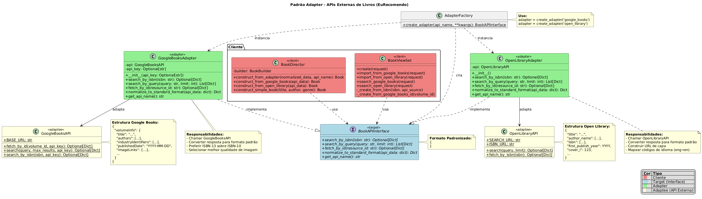

# Padrão Adapter - APIs Externas de Livros

## 1. Introdução ao Padrão Adapter

### O que é?

O **Adapter** (Adaptador) é um padrão de projeto estrutural do GoF (Gang of Four) que permite que interfaces incompatíveis trabalhem juntas. Ele atua como um "tradutor" entre duas interfaces que não podem se comunicar diretamente.

### Problema que Resolve

No contexto do **EuRecomendo**, tínhamos:

- **Múltiplas APIs externas** (Google Books, Open Library) com interfaces diferentes
- **Código do Director** que precisava lidar com estruturas de dados específicas de cada API
- **Dificuldade em adicionar novas APIs** sem modificar código existente
- **Violação do princípio Open/Closed** (código aberto para extensão, fechado para modificação)

### Solução com Adapter

O padrão Adapter cria uma interface unificada (`BookAPIInterface`) que:

1. Define um contrato comum para todas as APIs
2. Permite que cada API específica seja "adaptada" para este contrato
3. Facilita a adição de novas APIs sem modificar código existente
4. Torna o código mais testável e manutenível

### Analogia do Mundo Real

Imagine um **adaptador de tomada de viagem**:
- Você tem um notebook brasileiro (cliente)
- A tomada europeia tem formato diferente (interface incompatível)
- O adaptador converte o formato europeu para o brasileiro
- Você pode usar o mesmo notebook em qualquer lugar com adaptadores apropriados

## 2. Estrutura da Implementação

### Diagrama UML



### Componentes

```
┌─────────────────────┐
│  BookViewSet        │  (Cliente)
│  BookDirector       │
└──────────┬──────────┘
           │ usa
           ▼
┌─────────────────────┐
│ BookAPIInterface    │  (Target - Interface comum)
├─────────────────────┤
│ + search_by_isbn()  │
│ + search_by_query() │
│ + fetch_by_id()     │
│ + normalize()       │
│ + get_api_name()    │
└──────────△──────────┘
           │ implementa
           │
    ┌──────┴──────┐
    │             │
┌───▼────────┐ ┌──▼──────────┐
│ GoogleBooks│ │ OpenLibrary │  (Adapters)
│ Adapter    │ │ Adapter     │
└─────┬──────┘ └──────┬──────┘
      │ adapta        │ adapta
      ▼               ▼
┌────────────┐  ┌──────────────┐
│ GoogleBooks│  │ OpenLibrary  │  (Adaptees)
│ API        │  │ API          │
└────────────┘  └──────────────┘
```

### Arquivos Criados/Modificados

**Criados:**
- `backend/books/adapters.py` - Implementação dos adapters

**Modificados:**
- `backend/books/builders.py` - Método `construct_from_adapter()`
- `backend/books/views.py` - Uso dos adapters nos endpoints
- `backend/books/tests.py` - Testes dos adapters

**Sem Alteração:**
- `backend/books/external_apis.py` - Classes originais mantidas
- `backend/books/models.py` - Modelo Book mantido

## 3. Casos de Uso

### Caso de Uso 1: Buscar Livro por ISBN

**Antes (sem Adapter):**
```python
# Código específico para cada API
google_data = GoogleBooksAPI.search_by_isbn(isbn)
if google_data:
    book = director.construct_from_google_books(google_data)
else:
    ol_data = OpenLibraryAPI.fetch_by_isbn(isbn)
    book = director.construct_from_open_library(ol_data)
```

**Depois (com Adapter):**
```python
# Interface unificada
adapter = GoogleBooksAdapter()  # ou OpenLibraryAdapter()
normalized_data = adapter.search_by_isbn(isbn)
if normalized_data:
    book = director.construct_from_adapter(normalized_data, adapter.get_api_name())
```

### Caso de Uso 2: Adicionar Nova API

**Antes:** Seria necessário:
1. Criar novo método no `BookDirector` (ex: `construct_from_amazon()`)
2. Modificar código em múltiplos lugares
3. Adicionar lógica específica em cada view

**Depois:** Apenas:
```python
# 1. Criar novo adapter
class AmazonBooksAdapter(BookAPIInterface):
    def search_by_isbn(self, isbn):
        # Implementação específica
        pass

    def normalize_to_standard_format(self, api_data):
        # Converte formato Amazon para formato padrão
        pass

# 2. Usar imediatamente!
adapter = AmazonBooksAdapter()
book = director.construct_from_adapter(
    adapter.search_by_isbn(isbn),
    adapter.get_api_name()
)
```

### Caso de Uso 3: Trocar API em Tempo de Execução

```python
from books.adapters import create_adapter

# Factory permite criação dinâmica
api_name = request.data.get('api_source', 'google_books')
adapter = create_adapter(api_name)  # Cria adapter apropriado

# Mesmo código funciona para qualquer API
normalized_data = adapter.search_by_isbn(isbn)
book = director.construct_from_adapter(normalized_data, adapter.get_api_name())
```

## 4. Exemplos de Código

### Exemplo 1: Uso Básico do Adapter

```python
from books.adapters import GoogleBooksAdapter

# Criar adapter
adapter = GoogleBooksAdapter(api_key='YOUR_KEY')

# Buscar por ISBN (retorna formato normalizado)
book_data = adapter.search_by_isbn('9780132350884')

print(book_data)
# {
#     'title': 'Clean Code',
#     'authors': ['Robert C. Martin'],
#     'isbn': '9780132350884',
#     'publisher': 'Prentice Hall',
#     'published_date': '2008-08-01',
#     'description': '...',
#     'cover_url': 'https://...',
#     'page_count': 464,
#     'categories': ['Computers', 'Programming'],
#     'language': 'en',
#     'average_rating': 4.5
# }
```

### Exemplo 2: Integração com Builder/Director

```python
from books.adapters import GoogleBooksAdapter, OpenLibraryAdapter
from books.builders import BookDirector

director = BookDirector()

# Com Google Books
google_adapter = GoogleBooksAdapter()
google_data = google_adapter.search_by_isbn('9780132350884')
book1 = director.construct_from_adapter(google_data, 'google_books')

# Com Open Library (mesma interface!)
ol_adapter = OpenLibraryAdapter()
ol_data = ol_adapter.search_by_isbn('0451524934')
book2 = director.construct_from_adapter(ol_data, 'open_library')
```

### Exemplo 3: Uso nos Endpoints da API REST

```python
# POST /api/books/
# Body: { "import_isbn": "9780132350884", "api_source": "google_books" }

def create(self, request):
    isbn = request.data.get('import_isbn')
    api_source = request.data.get('api_source', 'google_books')

    # Adapter escolhido dinamicamente
    if api_source == 'google_books':
        adapter = GoogleBooksAdapter()
    else:
        adapter = OpenLibraryAdapter()

    # Mesmo fluxo para ambas APIs
    normalized_data = adapter.search_by_isbn(isbn)
    director = BookDirector()
    book = director.construct_from_adapter(normalized_data, adapter.get_api_name())

    serializer = BookSerializer(book)
    return Response(serializer.data, status=201)
```

### Exemplo 4: Factory Pattern

```python
from books.adapters import create_adapter

# Criação dinâmica via factory
adapter = create_adapter('google_books', api_key='YOUR_KEY')
# ou
adapter = create_adapter('open_library')

# Uso uniforme
results = adapter.search_by_query('clean code', limit=10)
for book in results:
    print(f"{book['title']} - {', '.join(book['authors'])}")
```

## 5. Endpoints da API

### Novos Endpoints

#### Importar do Open Library
```http
POST /api/books/import-open-library/
Content-Type: application/json

{
    "isbn": "0451524934"
}

Response 201:
{
    "id": 123,
    "title": "1984",
    "author": "George Orwell",
    "isbn": "0451524934",
    "source": "open_library",
    ...
}
```

#### Buscar no Open Library
```http
GET /api/books/search-open-library/?q=1984+orwell

Response 200:
{
    "count": 10,
    "api_source": "open_library",
    "results": [
        {
            "title": "1984",
            "authors": ["George Orwell"],
            "isbn": "0451524934",
            ...
        }
    ]
}
```

### Endpoints Atualizados

#### Buscar no Google Books (agora usa Adapter)
```http
GET /api/books/search-google-books/?q=clean+code

Response 200:
{
    "count": 10,
    "api_source": "google_books",
    "results": [
        {
            "title": "Clean Code",
            "authors": ["Robert C. Martin"],
            ...
        }
    ]
}
```

## 6. Testes

### Executar Testes

```bash
cd backend

# Todos os testes de adapter
python manage.py test books.tests.GoogleBooksAdapterTestCase
python manage.py test books.tests.OpenLibraryAdapterTestCase
python manage.py test books.tests.AdapterFactoryTestCase
python manage.py test books.tests.BookDirectorAdapterIntegrationTestCase

# Ou todos de uma vez
python manage.py test books
```

### Cobertura de Testes

**GoogleBooksAdapter:**
- ✓ Busca por ISBN com sucesso e normalização
- ✓ ISBN não encontrado retorna None
- ✓ Busca por query com múltiplos resultados
- ✓ Busca por ID do volume
- ✓ Preferência por ISBN-13
- ✓ Tratamento de campos faltando
- ✓ Nome da API correto

**OpenLibraryAdapter:**
- ✓ Busca por ISBN com sucesso
- ✓ ISBN não encontrado
- ✓ Busca por query
- ✓ fetch_by_id não suportado (retorna None)
- ✓ Construção de URL de capa
- ✓ Mapeamento de códigos de idioma
- ✓ Seleção do ISBN mais longo

**Factory:**
- ✓ Criação de GoogleBooksAdapter
- ✓ Criação de OpenLibraryAdapter
- ✓ Criação com argumentos
- ✓ API desconhecida levanta erro

**Integração:**
- ✓ Construção via adapter do Google Books
- ✓ Construção via adapter do Open Library
- ✓ Erro quando título ausente
- ✓ Adapters são intercambiáveis

### Exemplo de Teste

```python
from books.adapters import GoogleBooksAdapter

def test_adapter():
    adapter = GoogleBooksAdapter()

    # Mock do Google Books API
    with patch('books.adapters.GoogleBooksAPI.search_by_isbn') as mock:
        mock.return_value = {
            'volumeInfo': {
                'title': 'Clean Code',
                'authors': ['Robert C. Martin']
            }
        }

        result = adapter.search_by_isbn('9780132350884')

        assert result['title'] == 'Clean Code'
        assert result['authors'] == ['Robert C. Martin']
```

## 7. Benefícios da Implementação

### Antes do Adapter

- Código acoplado às APIs específicas
- Dificuldade para adicionar novas APIs
- Lógica duplicada no Director
- Difícil de testar
- Viola princípio Open/Closed

### Depois do Adapter

- **Interface Unificada:** Todas as APIs seguem o mesmo contrato
- **Extensibilidade:** Adicionar nova API requer apenas criar um novo adapter
- **Testabilidade:** Fácil de mockar adapters em testes
- **Manutenibilidade:** Mudanças em uma API não afetam outras
- **Reutilização:** Director usa um único método para todas as APIs
- **Princípios SOLID:** Segue Open/Closed e Dependency Inversion

## 8. Princípios de Design Aplicados

### Open/Closed Principle (Aberto/Fechado)
- **Aberto para extensão:** Novos adapters podem ser adicionados
- **Fechado para modificação:** BookDirector e views não precisam ser modificados

### Dependency Inversion Principle (Inversão de Dependência)
- **Antes:** Director dependia de classes concretas (GoogleBooksAPI, OpenLibraryAPI)
- **Depois:** Director depende da abstração (BookAPIInterface)

### Single Responsibility Principle (Responsabilidade Única)
- **Adapter:** Apenas traduz interface
- **Director:** Apenas constrói objetos
- **APIs:** Apenas fazem requisições

### Interface Segregation Principle (Segregação de Interface)
- **BookAPIInterface:** Contém apenas métodos necessários
- Cada adapter implementa de acordo com capacidades da API

## 9. Padrões Relacionados

### Adapter + Builder

O projeto combina dois padrões GoF:

1. **Adapter:** Normaliza dados de APIs externas
2. **Builder:** Constrói objetos Book de forma incremental

```python
# Adapter normaliza
normalized = adapter.search_by_isbn(isbn)

# Director usa Builder para construir
director = BookDirector()
book = director.construct_from_adapter(normalized, api_name)
```

### Adapter + Factory

A função `create_adapter()` implementa o padrão Factory:

```python
def create_adapter(api_name: str, **kwargs) -> BookAPIInterface:
    adapters = {
        'google_books': GoogleBooksAdapter,
        'open_library': OpenLibraryAdapter
    }
    return adapters[api_name](**kwargs)
```

## 10. Possíveis Extensões

### Adicionar Cache

```python
from django.core.cache import cache

class CachedGoogleBooksAdapter(GoogleBooksAdapter):
    def search_by_isbn(self, isbn):
        cache_key = f'book_isbn_{isbn}'
        cached = cache.get(cache_key)
        if cached:
            return cached

        result = super().search_by_isbn(isbn)
        cache.set(cache_key, result, timeout=3600)
        return result
```

### Adicionar Logging

```python
class LoggedAdapter(BookAPIInterface):
    def __init__(self, adapter: BookAPIInterface):
        self.adapter = adapter

    def search_by_isbn(self, isbn):
        logger.info(f"Buscando ISBN {isbn} em {self.adapter.get_api_name()}")
        result = self.adapter.search_by_isbn(isbn)
        logger.info(f"Resultado: {'encontrado' if result else 'não encontrado'}")
        return result
```

### Adicionar Retry Logic

```python
from tenacity import retry, stop_after_attempt

class ResilientAdapter(BookAPIInterface):
    def __init__(self, adapter: BookAPIInterface):
        self.adapter = adapter

    @retry(stop=stop_after_attempt(3))
    def search_by_isbn(self, isbn):
        return self.adapter.search_by_isbn(isbn)
```

## 11. Referências

- **Gang of Four (GoF):** Design Patterns: Elements of Reusable Object-Oriented Software
- **Padrão Adapter:** https://refactoring.guru/design-patterns/adapter
- **Google Books API:** https://developers.google.com/books/docs/v1/using
- **Open Library API:** https://openlibrary.org/developers/api
- **Django REST Framework:** https://www.django-rest-framework.org/
