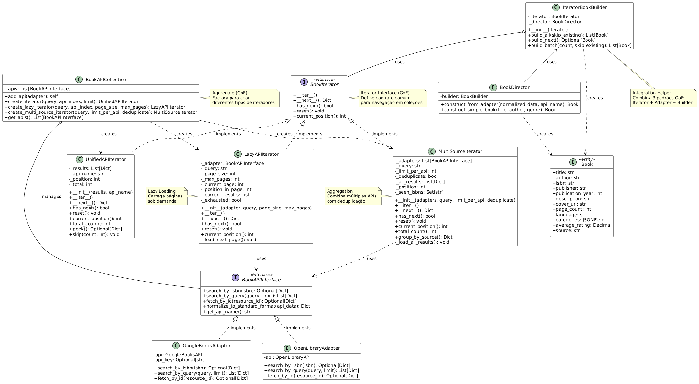

# Padrão Iterator - Navegação em Resultados de APIs

## 1. Introdução ao Padrão Iterator

### O que é?

O **Iterator** (Iterador) é um padrão de projeto comportamental do GoF (Gang of Four) que fornece uma maneira de acessar sequencialmente os elementos de uma coleção agregada sem expor sua representação interna.

### Problema que Resolve

No contexto do **EuRecomendo**, após implementarmos os padrões **Adapter** e **Builder**, enfrentávamos novos desafios:

- **Navegação complexa** em resultados de APIs paginadas
- **Uso de memória** ao carregar todos os resultados de uma vez
- **Lógica de iteração espalhada** pelo código
- **Dificuldade em combinar** resultados de múltiplas APIs
- **Duplicação de livros** quando buscando em várias fontes
- **Falta de controle fino** sobre o processo de iteração

### Solução com Iterator

O padrão Iterator fornece:

1. Interface uniforme para navegar em coleções de resultados
2. Lazy loading para economizar memória e requisições HTTP
3. Agregação transparente de múltiplas APIs (Google Books + Open Library)
4. Deduplicação automática de resultados
5. Integração perfeita com os padrões Adapter e Builder já implementados

### Analogia do Mundo Real

Imagine uma **playlist de música em streaming**:
- Você pode navegar pelas músicas (next, previous)
- As músicas são carregadas sob demanda (não todas de uma vez)
- Você pode combinar playlists de diferentes serviços
- Músicas duplicadas são automaticamente removidas
- Você não precisa saber como os dados estão armazenados

## 2. Estrutura da Implementação

### Diagrama UML



### Componentes

```
┌─────────────────────────┐
│   BookIterator          │  (Iterator Interface)
├─────────────────────────┤
│ + __iter__()            │
│ + __next__(): Dict      │
│ + has_next(): bool      │
│ + reset(): void         │
│ + current_position(): int│
└──────────△──────────────┘
           │ implementa
           │
    ┌──────┴─────┬──────────────────┬────────────────┐
    │            │                  │                │
┌───▼────────┐ ┌─▼──────────────┐ ┌─▼──────────────┐│
│ Unified    │ │ Lazy           │ │ MultiSource    ││
│ API        │ │ API            │ │ Iterator       ││
│ Iterator   │ │ Iterator       │ │                ││
└────────────┘ └────────────────┘ └────────────────┘│
                                                     │
┌────────────────────────┐                          │
│ BookAPICollection      │  (Aggregate)             │
├────────────────────────┤                          │
│ - _apis: List          │  creates                 │
│ + add_api()            ├──────────────────────────┘
│ + create_iterator()    │
│ + create_lazy_...()    │
│ + create_multi_...()   │
└────────────────────────┘
         │
         │ manages
         ▼
┌────────────────────────┐
│ BookAPIInterface       │  (Adapter Pattern)
│ (GoogleBooks,          │
│  OpenLibrary)          │
└────────────────────────┘
```

### Arquivos Criados/Modificados

**Criados:**
- `backend/books/iterators.py` (~620 linhas) - Implementação completa do Iterator
- `backend/books/test_iterators.py` (~525 linhas) - 30+ testes abrangentes

**Utilizados (padrões anteriores):**
- `backend/books/adapters.py` - BookAPIInterface, GoogleBooksAdapter, OpenLibraryAdapter
- `backend/books/builders.py` - BookDirector para criação de Books
- `backend/books/models.py` - Modelo Book

## 3. Tipos de Iteradores

### 3.1 UnifiedAPIIterator

Itera sobre resultados já carregados de uma única API.

**Características:**
- Carrega todos os resultados de uma vez
- Navegação com controle fino (next, peek, skip, reset)
- Ideal para conjuntos pequenos de resultados
- Acesso rápido a qualquer posição

**Quando Usar:**
- Quando você precisa processar todos os resultados
- Quando o conjunto de dados é pequeno (<50 itens)
- Quando você precisa de operações como peek ou skip

**Exemplo:**
```python
from books.adapters import GoogleBooksAdapter
from books.iterators import UnifiedAPIIterator

# Busca no Google Books
adapter = GoogleBooksAdapter()
results = adapter.search_by_query("clean code", limit=10)

# Cria iterador
iterator = UnifiedAPIIterator(results, api_name='google_books')

# Operações disponíveis
print(f"Total de resultados: {iterator.total_count()}")
print(f"Posição atual: {iterator.current_position()}")

# Peek sem avançar
next_book = iterator.peek()
print(f"Próximo: {next_book['title']}")

# Itera normalmente
for book_data in iterator:
    print(f"{book_data['title']} - {book_data['authors']}")

# Pula 3 elementos
iterator.reset()
iterator.skip(3)
book = next(iterator)  # Retorna o 4º livro
```

**Arquivo:** `backend/books/iterators.py:85-175`

---

### 3.2 LazyAPIIterator

Itera carregando resultados sob demanda (página por página).

**Características:**
- Lazy loading - carrega apenas quando necessário
- Economia de memória
- Economia de requisições HTTP
- Ideal para exploração de resultados

**Quando Usar:**
- Quando você não sabe quantos resultados precisará processar
- Quando quer economizar memória
- Quando quer evitar requisições desnecessárias
- Para processar apenas os primeiros N resultados

**Exemplo:**
```python
from books.adapters import GoogleBooksAdapter
from books.iterators import LazyAPIIterator

adapter = GoogleBooksAdapter()

# Cria iterador lazy (10 por página, máximo 5 páginas)
iterator = LazyAPIIterator(
    adapter,
    query="python programming",
    page_size=10,
    max_pages=5
)

# Processa apenas os 5 primeiros (economiza requisições!)
for i, book_data in enumerate(iterator):
    if i >= 5:
        break
    print(book_data['title'])
    # Próxima página só é carregada se necessário

print(f"Posição atual: {iterator.current_position()}")
print(f"API: {iterator.get_api_name()}")
```

**Arquivo:** `backend/books/iterators.py:178-284`

---

### 3.3 MultiSourceIterator

Combina resultados de múltiplas APIs em uma única iteração.

**Características:**
- Agrega resultados de várias APIs (Google Books + Open Library)
- Deduplicação automática por ISBN
- Resiliência a falhas de API
- Metadados de origem em cada resultado
- Agrupamento por fonte

**Quando Usar:**
- Quando você quer buscar em múltiplas APIs
- Quando quer maximizar a cobertura de resultados
- Quando quer evitar duplicatas
- Para ter fallback automático entre APIs

**Exemplo:**
```python
from books.adapters import GoogleBooksAdapter, OpenLibraryAdapter
from books.iterators import MultiSourceIterator

# Cria adapters
google = GoogleBooksAdapter()
open_lib = OpenLibraryAdapter()

# Iterador multi-fonte com deduplicação
iterator = MultiSourceIterator(
    adapters=[google, open_lib],
    query="1984 orwell",
    limit_per_api=10,
    deduplicate_by_isbn=True  # Remove duplicatas
)

# Itera sobre resultados agregados
for book_data in iterator:
    print(f"{book_data['title']} (fonte: {book_data['_api_source']})")

# Informações úteis
print(f"Total de resultados únicos: {iterator.total_count()}")

# Agrupa por fonte
grouped = iterator.group_by_source()
print(f"Google Books: {len(grouped['google_books'])} resultados")
print(f"Open Library: {len(grouped['open_library'])} resultados")
```

**Arquivo:** `backend/books/iterators.py:287-407`

---

## 4. Aggregate: BookAPICollection

A classe `BookAPICollection` atua como um **Aggregate** (coleção agregada) que gerencia múltiplas APIs e fornece **factory methods** para criar diferentes tipos de iteradores.

### Características

- Gerencia lista de adapters de APIs
- Factory methods para criar iteradores
- Interface fluente (method chaining)
- Abstrai a criação de iteradores

### Exemplo Completo

```python
from books.adapters import GoogleBooksAdapter, OpenLibraryAdapter
from books.iterators import BookAPICollection

# 1. Cria coleção
collection = BookAPICollection()

# 2. Adiciona APIs (method chaining)
collection.add_api(GoogleBooksAdapter()).add_api(OpenLibraryAdapter())

# 3. Cria diferentes tipos de iteradores

# Iterador simples (Google Books)
unified = collection.create_iterator(
    query="django",
    api_index=0,  # Índice da API (0 = primeira adicionada)
    limit=20
)

# Iterador lazy (Open Library)
lazy = collection.create_lazy_iterator(
    query="flask",
    api_index=1,  # 1 = segunda API
    page_size=5,
    max_pages=10
)

# Iterador multi-fonte (todas as APIs)
multi = collection.create_multi_source_iterator(
    query="fastapi",
    limit_per_api=15,
    deduplicate=True
)

# 4. Usa os iteradores
for book in unified:
    print(book['title'])
```

**Arquivo:** `backend/books/iterators.py:410-507`

---

## 5. Integração com Builder: IteratorBookBuilder

A classe `IteratorBookBuilder` integra o padrão **Iterator** com o padrão **Builder**, permitindo criar objetos `Book` automaticamente a partir dos resultados iterados.

### Características

- Combina 3 padrões GoF: **Iterator + Adapter + Builder**
- Converte dados normalizados em objetos Book
- Skip automático de livros já existentes (por ISBN)
- Processamento em lote
- Tratamento de erros

### Métodos

#### `build_all(skip_existing=True)`
Cria todos os Books do iterador de uma vez.

```python
from books.adapters import GoogleBooksAdapter
from books.iterators import BookAPICollection, IteratorBookBuilder

collection = BookAPICollection()
collection.add_api(GoogleBooksAdapter())

iterator = collection.create_iterator("clean code", limit=20)
builder_helper = IteratorBookBuilder(iterator)

# Cria todos os livros
books = builder_helper.build_all(skip_existing=True)
print(f"Criados {len(books)} livros no banco de dados")

# Verifica
for book in books:
    print(f"✓ {book.title} (ISBN: {book.isbn})")
```

#### `build_next()`
Cria o próximo Book, um por vez.

```python
builder_helper = IteratorBookBuilder(iterator)

# Processa um por um
while True:
    book = builder_helper.build_next()
    if book is None:
        break
    print(f"Criado: {book.title}")
```

#### `build_batch(count, skip_existing=True)`
Cria um número específico de Books.

```python
builder_helper = IteratorBookBuilder(iterator)

# Cria apenas 5 livros
batch = builder_helper.build_batch(count=5, skip_existing=True)
print(f"Criados {len(batch)} livros")
```

**Arquivo:** `backend/books/iterators.py:510-623`

---

## 6. Casos de Uso Práticos

### Caso de Uso 1: Busca Simples e Importação

```python
from books.adapters import GoogleBooksAdapter
from books.iterators import UnifiedAPIIterator, IteratorBookBuilder

def import_books_simple(query: str, limit: int = 10):
    """Busca e importa livros de forma simples."""
    # 1. Adapter busca e normaliza
    adapter = GoogleBooksAdapter()
    results = adapter.search_by_query(query, limit=limit)

    # 2. Iterator navega pelos resultados
    iterator = UnifiedAPIIterator(results, api_name='google_books')

    # 3. Builder cria objetos Book
    builder = IteratorBookBuilder(iterator)
    books = builder.build_all(skip_existing=True)

    return books

# Uso
books = import_books_simple("python programming", limit=20)
print(f"Importados {len(books)} livros")
```

---

### Caso de Uso 2: Exploração Lazy (Economia de Recursos)

```python
from books.adapters import GoogleBooksAdapter
from books.iterators import LazyAPIIterator

def find_specific_book(query: str, title_contains: str):
    """Busca até encontrar livro específico sem carregar tudo."""
    adapter = GoogleBooksAdapter()
    iterator = LazyAPIIterator(
        adapter,
        query=query,
        page_size=10,
        max_pages=10
    )

    # Processa apenas até encontrar
    for book in iterator:
        if title_contains.lower() in book['title'].lower():
            print(f"Encontrado na posição {iterator.current_position()}")
            return book
        # Carrega próxima página apenas se necessário

    return None

# Uso - economiza requisições parando quando encontra
book = find_specific_book("software engineering", "Clean Code")
```

---

### Caso de Uso 3: Agregação de Múltiplas Fontes

```python
from books.adapters import GoogleBooksAdapter, OpenLibraryAdapter
from books.iterators import MultiSourceIterator, IteratorBookBuilder

def import_from_all_sources(query: str, max_per_api: int = 20):
    """Importa de todas as APIs disponíveis."""
    # Múltiplas APIs
    adapters = [
        GoogleBooksAdapter(),
        OpenLibraryAdapter()
    ]

    # Iterador multi-fonte com deduplicação
    iterator = MultiSourceIterator(
        adapters,
        query=query,
        limit_per_api=max_per_api,
        deduplicate_by_isbn=True
    )

    # Importa todos
    builder = IteratorBookBuilder(iterator)
    books = builder.build_all(skip_existing=True)

    # Relatório por fonte
    grouped = iterator.group_by_source()
    for api_name, results in grouped.items():
        print(f"{api_name}: {len(results)} resultados")

    return books

# Uso
books = import_from_all_sources("django", max_per_api=30)
print(f"Total importado: {len(books)} livros únicos")
```

---

### Caso de Uso 4: Processamento em Lote Controlado

```python
from books.adapters import GoogleBooksAdapter
from books.iterators import BookAPICollection, IteratorBookBuilder

def import_in_batches(query: str, batch_size: int = 10, max_total: int = 50):
    """Importa em lotes com controle fino."""
    collection = BookAPICollection()
    collection.add_api(GoogleBooksAdapter())

    iterator = collection.create_lazy_iterator(
        query=query,
        page_size=batch_size,
        max_pages=10
    )

    builder = IteratorBookBuilder(iterator)
    total_imported = 0

    while iterator.has_next() and total_imported < max_total:
        # Processa lote
        batch = builder.build_batch(
            count=min(batch_size, max_total - total_imported),
            skip_existing=True
        )
        total_imported += len(batch)

        print(f"Lote processado: {len(batch)} livros")
        print(f"Total até agora: {total_imported}")

        # Pode adicionar lógica de pausa, logging, etc.

    return total_imported

# Uso
count = import_in_batches("machine learning", batch_size=10, max_total=50)
```

---

### Caso de Uso 5: Sistema de Recomendação Completo

```python
from books.adapters import GoogleBooksAdapter, OpenLibraryAdapter
from books.iterators import BookAPICollection, IteratorBookBuilder
from books.models import Book

class BookRecommendationSystem:
    """Sistema que usa Iterator para popular banco de recomendações."""

    def __init__(self):
        self.collection = BookAPICollection()
        self.collection.add_api(GoogleBooksAdapter())
        self.collection.add_api(OpenLibraryAdapter())

    def populate_genre(self, genre: str, limit_per_api: int = 20):
        """Popula banco com livros de um gênero."""
        # Busca em todas as APIs
        iterator = self.collection.create_multi_source_iterator(
            query=genre,
            limit_per_api=limit_per_api,
            deduplicate=True
        )

        # Importa para banco
        builder = IteratorBookBuilder(iterator)
        books = builder.build_all(skip_existing=True)

        print(f"✓ Gênero '{genre}': {len(books)} livros importados")
        return books

    def populate_multiple_genres(self, genres: list):
        """Popula múltiplos gêneros."""
        total_books = []

        for genre in genres:
            books = self.populate_genre(genre, limit_per_api=15)
            total_books.extend(books)

        return total_books

    def get_stats(self):
        """Retorna estatísticas do banco."""
        return {
            'total_books': Book.objects.count(),
            'sources': Book.objects.values('source').distinct(),
            'with_rating': Book.objects.filter(
                average_rating__isnull=False
            ).count()
        }

# Uso
recommender = BookRecommendationSystem()

# Popula com diferentes gêneros
genres = [
    "Python Programming",
    "Web Development",
    "Data Science",
    "DevOps",
    "Machine Learning"
]

all_books = recommender.populate_multiple_genres(genres)

print(f"\n=== Relatório ===")
print(f"Total importado: {len(all_books)} livros")

stats = recommender.get_stats()
print(f"Total no banco: {stats['total_books']}")
print(f"Com avaliação: {stats['with_rating']}")
```

---

## 7. Endpoints da API (Possível Extensão)

Embora os iteradores sejam principalmente usados internamente, eles podem ser expostos via API:

### Buscar com Paginação Lazy

```http
GET /api/books/search-lazy/?q=python&page_size=10&page=1

Response 200:
{
    "query": "python",
    "current_page": 1,
    "page_size": 10,
    "has_next": true,
    "results": [
        {
            "title": "Python Programming",
            "authors": ["John Doe"],
            "isbn": "9781234567890",
            ...
        }
    ]
}
```

### Buscar em Múltiplas Fontes

```http
GET /api/books/search-multi-source/?q=django&deduplicate=true

Response 200:
{
    "query": "django",
    "total_results": 25,
    "sources_used": ["google_books", "open_library"],
    "duplicates_removed": 3,
    "results": [...],
    "grouped_by_source": {
        "google_books": 15,
        "open_library": 10
    }
}
```

### Importar em Lote

```http
POST /api/books/import-batch/
Content-Type: application/json

{
    "query": "machine learning",
    "sources": ["google_books", "open_library"],
    "limit_per_source": 20,
    "deduplicate": true,
    "skip_existing": true
}

Response 201:
{
    "imported_count": 35,
    "skipped_count": 5,
    "by_source": {
        "google_books": 20,
        "open_library": 15
    }
}
```

---

## 8. Testes

### Executar Testes

```bash
# Via Docker
docker-compose exec backend python manage.py test books.test_iterators -v 2

# Localmente
cd backend
python manage.py test books.test_iterators -v 2

# Testes específicos
python manage.py test books.test_iterators.UnifiedAPIIteratorTest
python manage.py test books.test_iterators.LazyAPIIteratorTest
python manage.py test books.test_iterators.MultiSourceIteratorTest
python manage.py test books.test_iterators.BookAPICollectionTest
python manage.py test books.test_iterators.IteratorBookBuilderTest
python manage.py test books.test_iterators.IntegrationTest
```

### Cobertura de Testes (30+ testes)

#### UnifiedAPIIterator (8 testes)
- ✅ `test_iterator_initialization` - Inicialização correta
- ✅ `test_iteration` - Iteração básica com next()
- ✅ `test_for_loop_iteration` - Compatibilidade com for loop
- ✅ `test_reset` - Reinicialização do iterador
- ✅ `test_peek` - Peek sem avançar posição
- ✅ `test_skip` - Pular elementos
- ✅ `test_empty_results` - Resultados vazios
- ✅ `test_none_results` - Tratamento de None

#### LazyAPIIterator (5 testes)
- ✅ `test_lazy_loading_first_page` - Carregamento inicial lazy
- ✅ `test_iteration_single_page` - Iteração em página única
- ✅ `test_empty_results` - Resultados vazios
- ✅ `test_api_error_handling` - Tratamento de erros da API
- ✅ `test_reset` - Reset do iterador lazy

#### MultiSourceIterator (5 testes)
- ✅ `test_multi_source_aggregation` - Agregação de múltiplas APIs
- ✅ `test_deduplication_by_isbn` - Deduplicação por ISBN
- ✅ `test_group_by_source` - Agrupamento por fonte
- ✅ `test_api_failure_resilience` - Resiliência a falhas
- ✅ `test_reset` - Reset do iterador

#### BookAPICollection (6 testes)
- ✅ `test_add_api` - Adição de APIs
- ✅ `test_add_api_chaining` - Method chaining
- ✅ `test_create_unified_iterator` - Criação de iterador unificado
- ✅ `test_create_lazy_iterator` - Criação de iterador lazy
- ✅ `test_create_multi_source_iterator` - Criação multi-fonte
- ✅ `test_empty_collection_error` - Validação de coleção vazia

#### IteratorBookBuilder (6 testes)
- ✅ `test_build_all` - Construção de todos os livros
- ✅ `test_build_next` - Construção incremental
- ✅ `test_build_batch` - Construção em lote
- ✅ `test_skip_existing_books` - Skip de livros existentes
- ✅ `test_build_with_invalid_data` - Tratamento de dados inválidos
- ✅ `test_complete_workflow` - Teste de integração completo

**Arquivo de testes:** `backend/books/test_iterators.py`

---

## 9. Integração de 3 Padrões GoF

O sistema integra perfeitamente três padrões de projeto:

### Fluxo de Integração

```
1. API Externa (Google Books, Open Library)
         │
         ▼
2. ADAPTER PATTERN
   BookAPIInterface (GoogleBooksAdapter, OpenLibraryAdapter)
   └─> Normaliza dados para formato padronizado
         │
         ▼
3. ITERATOR PATTERN
   BookIterator (UnifiedAPIIterator, LazyAPIIterator, MultiSourceIterator)
   └─> Navega pelos resultados normalizados
         │
         ▼
4. BUILDER PATTERN
   BookDirector (usa BookBuilder)
   └─> Constrói objetos Book a partir dos dados
         │
         ▼
5. Objeto Book criado e salvo no banco de dados
```

### Código Integrado

```python
from books.adapters import GoogleBooksAdapter, OpenLibraryAdapter
from books.builders import BookDirector
from books.iterators import MultiSourceIterator, IteratorBookBuilder

# 1. ADAPTER: Adapters das APIs
google = GoogleBooksAdapter()
open_lib = OpenLibraryAdapter()

# 2. ITERATOR: Iterador multi-fonte
iterator = MultiSourceIterator(
    adapters=[google, open_lib],
    query="clean code",
    deduplicate_by_isbn=True
)

# 3. BUILDER: Helper que integra Iterator + Builder
builder_helper = IteratorBookBuilder(iterator)

# 4. Executa tudo de uma vez!
books = builder_helper.build_all(skip_existing=True)

print(f"✓ Criados {len(books)} livros usando 3 padrões GoF!")
```

---

## 10. Benefícios da Implementação

### Antes do Iterator

- Código acoplado à lógica de paginação de cada API
- Difícil iterar sobre múltiplas APIs
- Carregamento de todos os resultados de uma vez (desperdício de memória)
- Duplicação de lógica de iteração
- Difícil adicionar novos tipos de iteração

### Depois do Iterator

✅ **Separação de Responsabilidades**
- Lógica de iteração separada da lógica de negócio
- Cada iterador tem responsabilidade única e clara

✅ **Lazy Loading**
- Economia de memória
- Economia de requisições HTTP
- Processamento sob demanda

✅ **Extensibilidade**
- Fácil adicionar novos tipos de iteradores
- Não precisa modificar código existente

✅ **Reutilização**
- Iteradores podem ser reutilizados em diferentes contextos
- Composição de iteradores

✅ **Testabilidade**
- Iteradores isolados são fáceis de testar
- 30+ testes cobrindo todos os cenários

✅ **Integração**
- Perfeita integração com Adapter e Builder
- Sistema coeso de 3 padrões GoF

---

## 11. Princípios de Design Aplicados

### Single Responsibility Principle (SRP)
- **UnifiedAPIIterator**: Apenas itera sobre lista em memória
- **LazyAPIIterator**: Apenas gerencia carregamento lazy
- **MultiSourceIterator**: Apenas agrega múltiplas fontes
- **BookAPICollection**: Apenas gerencia APIs e cria iteradores

### Open/Closed Principle (OCP)
- **Aberto para extensão:** Novos iteradores podem ser adicionados
- **Fechado para modificação:** Código cliente não precisa mudar

### Liskov Substitution Principle (LSP)
- Todos os iteradores implementam `BookIterator`
- São intercambiáveis no código cliente

### Interface Segregation Principle (ISP)
- `BookIterator` contém apenas métodos essenciais
- Cada iterador adiciona métodos específicos conforme necessário

### Dependency Inversion Principle (DIP)
- Código depende da abstração `BookIterator`
- Não depende de implementações concretas

---

## 12. Possíveis Extensões

### 12.1 CachedIterator

Adicionar cache de resultados:

```python
from django.core.cache import cache

class CachedIterator(BookIterator):
    """Iterator com cache de resultados."""

    def __init__(self, iterator: BookIterator, cache_key: str, timeout: int = 3600):
        self._iterator = iterator
        self._cache_key = cache_key
        self._timeout = timeout
        self._load_from_cache()

    def _load_from_cache(self):
        cached = cache.get(self._cache_key)
        if cached:
            self._results = cached
        else:
            self._results = list(self._iterator)
            cache.set(self._cache_key, self._results, self._timeout)

    # Implementa interface BookIterator...
```

### 12.2 FilteredIterator

Adicionar filtragem de resultados:

```python
class FilteredIterator(BookIterator):
    """Iterator que filtra resultados baseado em predicado."""

    def __init__(self, iterator: BookIterator, predicate):
        self._iterator = iterator
        self._predicate = predicate

    def __next__(self):
        while self._iterator.has_next():
            item = next(self._iterator)
            if self._predicate(item):
                return item
        raise StopIteration

# Uso
iterator = UnifiedAPIIterator(results)
filtered = FilteredIterator(
    iterator,
    predicate=lambda book: book.get('average_rating', 0) >= 4.0
)

# Itera apenas sobre livros bem avaliados
for book in filtered:
    print(book['title'])
```

### 12.3 RankedIterator

Ordenar resultados por relevância:

```python
class RankedIterator(BookIterator):
    """Iterator que ordena por scoring customizado."""

    def __init__(self, iterator: BookIterator, score_func):
        self._results = sorted(
            list(iterator),
            key=score_func,
            reverse=True
        )
        self._position = 0

    # Implementa interface...

# Uso
def score_book(book):
    score = 0
    if book.get('average_rating'):
        score += book['average_rating'] * 10
    if book.get('page_count'):
        score += min(book['page_count'] / 100, 5)
    return score

ranked = RankedIterator(iterator, score_func=score_book)
```

---

## 13. Boas Práticas

### ✅ Escolha o Iterador Certo

```python
# Conjunto pequeno conhecido: UnifiedAPIIterator
if num_results <= 50:
    iterator = UnifiedAPIIterator(results)

# Exploração/busca: LazyAPIIterator
if searching_for_specific_item:
    iterator = LazyAPIIterator(adapter, query, page_size=10)

# Máxima cobertura: MultiSourceIterator
if need_comprehensive_results:
    iterator = MultiSourceIterator(adapters, query, deduplicate=True)
```

### ✅ Sempre Use try/except

```python
builder = IteratorBookBuilder(iterator)
try:
    books = builder.build_all(skip_existing=True)
except Exception as e:
    logger.error(f"Erro ao importar livros: {e}")
    books = []
```

### ✅ Use Logging

```python
import logging
logger = logging.getLogger(__name__)

for book_data in iterator:
    logger.info(f"Processando: {book_data['title']}")
    # ...
```

### ✅ Monitore Recursos

```python
# Limite o número de resultados
iterator = LazyAPIIterator(adapter, query, max_pages=10)

# Ou use batch processing
builder = IteratorBookBuilder(iterator)
batch = builder.build_batch(count=50, skip_existing=True)
```

---

## 14. Comparação: Antes vs Depois

### Antes (sem Iterator)

```python
# Código acoplado e difícil de manter
def import_books(query):
    google_api = GoogleBooksAPI()
    google_results = google_api.search(query, max_results=40)

    books = []
    for item in google_results.get('items', []):
        # Lógica de normalização inline
        volume_info = item.get('volumeInfo', {})
        title = volume_info.get('title')
        # ... muito código ...

        # Cria Book manualmente
        book = Book.objects.create(
            title=title,
            # ... muitos campos ...
        )
        books.append(book)

    return books
```

### Depois (com Iterator + Adapter + Builder)

```python
# Código limpo e extensível
def import_books(query):
    collection = BookAPICollection()
    collection.add_api(GoogleBooksAdapter())

    iterator = collection.create_iterator(query, limit=40)
    builder = IteratorBookBuilder(iterator)

    return builder.build_all(skip_existing=True)
```

**Redução de ~50 linhas para ~7 linhas!**

---

## 15. Métricas da Implementação

### Código Produzido
- **iterators.py**: ~620 linhas
- **test_iterators.py**: ~525 linhas
- **Total**: ~1145 linhas de código

### Testes
- **Total de testes**: 30+
- **Classes de teste**: 6
- **Cobertura**: Todos os componentes e casos de uso

### Componentes
- **Interfaces**: 1 (BookIterator)
- **Iteradores concretos**: 3 (Unified, Lazy, MultiSource)
- **Aggregate**: 1 (BookAPICollection)
- **Integration Helper**: 1 (IteratorBookBuilder)

---

## 16. Referências

- **Gang of Four (GoF):** Design Patterns: Elements of Reusable Object-Oriented Software
- **Padrão Iterator:** https://refactoring.guru/design-patterns/iterator
- **Python Iterators:** https://docs.python.org/3/tutorial/classes.html#iterators
- **Django QuerySets:** https://docs.djangoproject.com/en/stable/ref/models/querysets/
- **Documentação do Adapter:** `UC-Adapter.md`
- **Documentação do Builder:** `UC-Builder.md`

---

## 17. Conclusão

O padrão Iterator implementado no **EuRecomendo** fornece uma solução robusta e extensível para navegar por resultados de múltiplas APIs de livros. A integração perfeita com os padrões **Adapter** e **Builder** cria um sistema coeso e poderoso que demonstra o verdadeiro valor dos padrões de projeto GoF.

### Principais Conquistas

✅ **3 Padrões GoF Integrados**: Iterator + Adapter + Builder trabalhando juntos

✅ **Lazy Loading**: Economia de memória e requisições HTTP

✅ **Multi-Source**: Agregação inteligente de múltiplas APIs

✅ **Deduplicação**: Remoção automática de duplicatas por ISBN

✅ **Extensível**: Fácil adicionar novos iteradores e APIs

✅ **Testado**: 30+ testes cobrindo todos os cenários

✅ **Documentado**: Documentação completa com exemplos práticos

### Impacto no Projeto

A implementação do Iterator complementa os padrões anteriores e cria um sistema completo de importação de livros que é:
- **Fácil de usar**
- **Fácil de testar**
- **Fácil de estender**
- **Eficiente em recursos**
- **Robusto a falhas**

Este é um exemplo prático de como os padrões GoF, quando bem aplicados, resultam em código de alta qualidade, manutenível e profissional.
