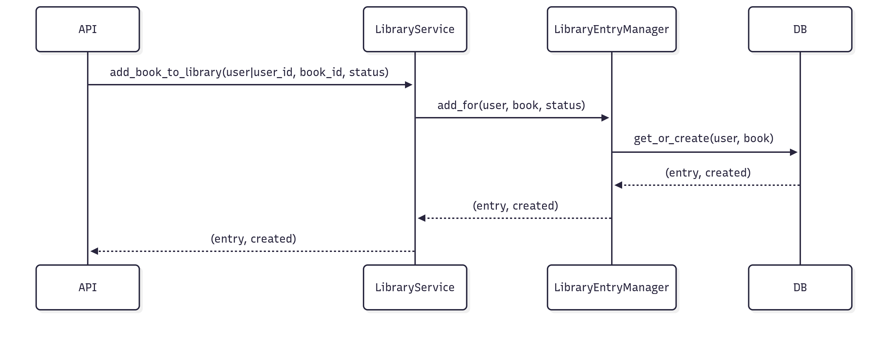

# 3.2.1 Facade — UC13 (Serviço de Aplicação)

## Introdução
O Facade é um padrão estrutural que fornece uma interface simples para um conjunto de operações complexas em subsistemas. No UC13, utilizamos um serviço de aplicação para concentrar validações, transações e orquestração da criação idempotente de `LibraryEntry`.

## Objetivo
- Fornecer um ponto único para a API invocar a operação “adicionar livro à biblioteca pessoal”.
- Esconder detalhes de busca de entidades, transações e reuso do Factory Method.
- Facilitar testes e manutenibilidade ao concentrar regras em um serviço.

## Vantagens
- Interface única e coesa para o caso de uso.
- Menor acoplamento entre a API e detalhes de persistência/regra.
- Reaproveita o Manager (Factory Method) e adiciona transação.

## Desvantagens
- Mais uma camada lógica para manter.
- Se sobrecarregado, pode virar um “Deus” de regras — manter coeso.

## Metodologia
- Ferramentas: VS Code, Docsify, Mermaid, Django/DRF, Docker, Postman.
- Referências: Refactoring Guru (Facade), Django Transactions.

## Diagrama



## Código (trecho principal)
```python
# backend/library/services.py
class LibraryService:
    @staticmethod
    @transaction.atomic
    def add_book_to_library(*, user=None, user_id=None, book_id, status="QUERO_LER"):
        User = get_user_model()
        if user is None:
            if user_id is None:
                raise ValueError("user ou user_id deve ser informado")
            user = User.objects.get(id=user_id)
        book = Book.objects.get(id=book_id)
        entry, created = LibraryEntry.objects.add_for(user=user, book=book, status=status)
        return entry, created
```

## Demonstração (resultado)
- POST `/api/library/` com `{ "book_id": 1, "status": "QUERO_LER" }` → (entry, created)
- Controle transacional evita inconsistências em falhas intermediárias.

## Passo a passo
1) Subir e preparar o ambiente

```bash
cd backend
docker compose up --build -d
docker compose exec web python manage.py migrate
docker compose exec web python manage.py createsuperuser
```

2) Obter token JWT (curl)

```bash
curl -X POST {{base_url}}/api/token/ \
    -H 'Content-Type: application/json' \
    -d '{"username":"admin","password":"<sua_senha>"}'
```

Resposta:

```json
{ "access": "<access_token>", "refresh": "<refresh_token>" }
```

3) Criar Book (autenticado)

```bash
curl -X POST {{base_url}}/api/books/ \
    -H "Content-Type: application/json" \
    -H "Authorization: Bearer <access_token>" \
    -d '{"title":"Clean Code","author":"Robert C. Martin"}'
```

4) Adicionar Book à Library (UC13)

```bash
curl -X POST {{base_url}}/api/library/ \
    -H "Content-Type: application/json" \
    -H "Authorization: Bearer <access_token>" \
    -d '{"book_id": 1, "status": "QUERO_LER"}'
```

No Postman: execute na ordem — `Auth → Obtain Token`, `Books → Create Book`, `Library → Add Book to Library (UC13)` (a coleção salva tokens automaticamente).

## Vídeo
- [Vídeo da execução](https://drive.google.com/file/d/1RxakFTaSErGhQch93RJRdHlRYdZU24PE/view?usp=sharing)

Participante: [Euller Júlio](https://github.com/Potatoyz908)

## Bibliografia
- Refactoring Guru — Facade: https://refactoring.guru/design-patterns/facade
- Django — Transactions: https://docs.djangoproject.com/en/stable/topics/db/transactions/

## Histórico de Versões
| Versão | Data       | Descrição                                   | Autor(es)          | Revisor(es) |
|--------|------------|---------------------------------------------|--------------------|-------------|
| 1.0    | 19/10/2025 | Criação do documento, adição dos códigos e diagrama base  | [Euller Júlio](https://www.github.com/Potatoyz908) | [Gabriel Castelo](https://github.com/GabrielCastelo-31)           |
| 1.1    | 22/10/2025 | Adicionado o vídeo da demonstração do código | [Euller Júlio](https://www.github.com/Potatoyz908) | [Gabriel Castelo](https://github.com/GabrielCastelo-31)           |

