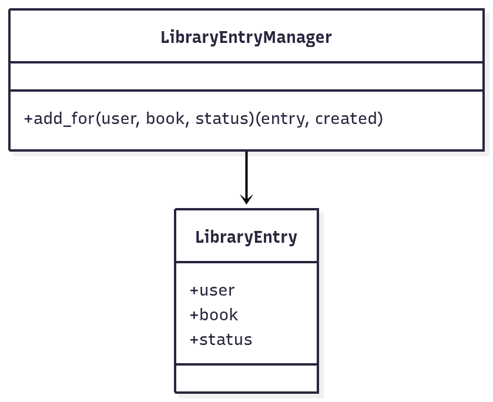

# 3.1.1 Factory Method — UC13 (Django Manager)

## Introdução
O Factory Method (Método de Fábrica) é um padrão criacional que fornece uma interface para criar objetos em uma superclasse, permitindo que subclasses ou componentes especializados alterem o tipo de objeto criado. No UC13 — “Adicionar livro à biblioteca pessoal (com status inicial)” — aplicamos este padrão no Manager do modelo para encapsular a criação idempotente do vínculo `User–Book` (Django).

## Objetivo
- Desacoplar a lógica de criação/atualização do vínculo `LibraryEntry` da camada de API.
- Fornecer um ponto único e idempotente de criação via `LibraryEntry.objects.add_for(...)`.
- Permitir evolução da regra de criação sem alterar consumidores (ex.: API, serviços).

## Vantagens
- Desacoplamento e SRP: centraliza a criação no Manager, facilitando manutenção/testes.
- Idempotência: `get_or_create` evita duplicidade (UniqueConstraint).
- Aberto/Fechado: novas regras de criação podem ser adicionadas no Manager.

## Desvantagens
- Pode introduzir uma camada adicional de indireção.
- Se mal aplicado, lógica excessiva no Manager pode dificultar leitura.

## Metodologia
- Ferramentas: VS Code, Docsify (documentação), Draw.io/Mermaid (diagramas), Django/DRF (implementação), Docker (execução), Postman (testes).
- Referências: GoF, Django Managers/get_or_create.

## Desenvolvimento
- Modelo `LibraryEntry` com `UniqueConstraint(user, book)`.
- Manager `LibraryEntryManager.add_for(user, book, status)` encapsula criação idempotente e atualização de status.

## Diagrama


## Código (trechos relevantes)
```python
# backend/library/models.py
class LibraryEntryManager(models.Manager):
    def add_for(self, user, book, status="QUERO_LER"):
        entry, created = self.get_or_create(
            user=user, book=book, defaults={"status": status}
        )
        if not created and status and entry.status != status:
            entry.status = status
            entry.save(update_fields=["status"])
        return entry, created

class LibraryEntry(models.Model):
    STATUS_CHOICES = (
        ("QUERO_LER", "Quero ler"),
        ("LENDO", "Lendo"),
        ("LIDO", "Lido"),
        ("ABANDONADO", "Abandonado"),
    )
    id_library_entry = models.AutoField(primary_key=True)
    user = models.ForeignKey(settings.AUTH_USER_MODEL, on_delete=models.CASCADE)
    book = models.ForeignKey('books.Book', on_delete=models.CASCADE)
    status = models.CharField(max_length=20, choices=STATUS_CHOICES, default="QUERO_LER")
    objects = LibraryEntryManager()
    class Meta:
        constraints = [
            models.UniqueConstraint(fields=["user", "book"], name="unique_user_book")
        ]
```

## Demonstração (resultado)
- POST `/api/library/` com payload `{ "book_id": 1, "status": "QUERO_LER" }`:
  - 201 + `created=true` na primeira inclusão.
  - 200 + `created=false` se o vínculo já existir (idempotência), com possível atualização de `status`.

## Passo a passo para rodar
1) Subir com Docker (na pasta `backend/`):
```bash
docker compose up --build
```
2) Aplicar migrações e criar superusuário:
```bash
docker compose exec web python manage.py migrate
docker compose exec web python manage.py createsuperuser
```
3) Obter tokens (JWT) via Postman ou curl

- Usando curl (substitua username/password e base_url):

```bash
curl -X POST {{base_url}}/api/token/ \
  -H 'Content-Type: application/json' \
  -d '{"username":"admin","password":"<sua_senha>"}'
```

Resposta esperada (JSON):

```json
{
  "access": "<access_token>",
  "refresh": "<refresh_token>"
}
```

- Usando Postman: rode a request `Auth → Obtain Token` da coleção; o script salvará `access_token` e `refresh_token` no Environment.

4) Criar um Book (autenticado)

- Exemplo curl (substitua <access_token> e base_url):

```bash
curl -X POST {{base_url}}/api/books/ \
  -H "Content-Type: application/json" \
  -H "Authorization: Bearer <access_token>" \
  -d '{"title":"Clean Code","author":"Robert C. Martin"}'
```

Resposta esperada: 201 CREATED com o objeto Book (id, title, author).

5) Adicionar o livro à biblioteca do usuário autenticado (UC13)

- Exemplo curl:

```bash
curl -X POST {{base_url}}/api/library/ \
  -H "Content-Type: application/json" \
  -H "Authorization: Bearer <access_token>" \
  -d '{"book_id": 1, "status": "QUERO_LER"}'
```

Resposta esperada:

- Se criação: HTTP 201 com o objeto LibraryEntry + campo `created: true`.
- Se já existia: HTTP 200 com `created: false`.

Observações:
- No Postman, ao usar a coleção, execute primeiro `Auth → Obtain Token`, depois `Books → Create Book` e `Library → Add Book to Library (UC13)`.


## Vídeo (demonstração)
- [Vídeo da execução](https://drive.google.com/file/d/1T93AZjNB4CKZI8qosw8IPjmXtamsgJMT/view?usp=sharing)

Participante: [Euller Júlio](https://github.com/Potatoyz908)
## Bibliografia
- Gamma, E. et al. Design Patterns: Elements of Reusable Object-Oriented Software. Addison-Wesley, 1995.
- Django — Managers e get_or_create: https://docs.djangoproject.com/en/stable/topics/db/managers/

## Histórico de Versões
| Versão | Data       | Descrição                                   | Autor(es)          | Revisor(es) |
|--------|------------|---------------------------------------------|--------------------|-------------|
| 1.0    | 19/10/2025 | Criação do documento, adição dos códigos e diagrama base  | [Euller Júlio](https://www.github.com/Potatoyz908) | [Gabriel Castelo](https://github.com/GabrielCastelo-31)           |
| 1.1    | 22/10/2025 | Adicionado o vídeo da demonstração do código | [Euller Júlio](https://www.github.com/Potatoyz908) | [Gabriel Castelo](https://github.com/GabrielCastelo-31)           |
