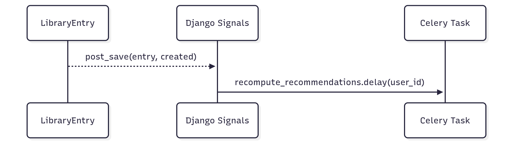

# 3.3.1 Observer — UC13 (Django Signals)

## Introdução
Observer é um padrão comportamental no qual objetos (Observers) são notificados sobre mudanças ocorridas em outro objeto (Subject). No UC13, o `LibraryEntry` atua como Subject: ao salvar, um Signal `post_save` notifica um handler que enfileira uma task Celery para atualizar recomendações.

## Objetivo
- Desacoplar a API dos efeitos assíncronos (ex.: recomputar recomendações).
- Permitir extensão futura adicionando/removendo handlers sem modificar a lógica central.

## Vantagens
- Baixo acoplamento entre a camada de gravação e efeitos colaterais.
- Extensibilidade: múltiplos handlers podem ouvir o mesmo evento.
- Testabilidade: é possível mockar/espionar handlers.

## Desvantagens
- Fluxo implícito (event-driven) pode dificultar rastreabilidade.
- Em ambientes sem Celery/broker, handler precisa ser resiliente (tratado no código).

## Metodologia
- Ferramentas: Django Signals, Celery (placeholder), VS Code, Docsify, Mermaid.
- Referências: Django Signals, patterns comportamentais.

## Diagrama


## Código (trechos principais)
```python
# backend/library/signals.py
@receiver(post_save, sender=LibraryEntry)
def library_entry_post_save(sender, instance: LibraryEntry, created, **kwargs):
    if recompute_recommendations is not None:
        try:
            recompute_recommendations.delay(user_id=instance.user_id)
        except Exception:
            pass

# backend/celery_app/tasks.py
@shared_task
def recompute_recommendations(user_id: int):
    return {"user_id": user_id, "status": "recomputed"}
```

## Demonstração
- Ao executar POST `/api/library/`, a criação/atualização do `LibraryEntry` dispara o `post_save` e agenda a task Celery para o `user_id` do vínculo.

## Passo a passo
1) Subir e preparar ambiente

```bash
cd backend
docker compose up --build -d
docker compose exec web python manage.py migrate
docker compose exec web python manage.py createsuperuser
```

2) Obter token JWT (curl)

```bash
curl -X POST {{base_url}}/api/token/ \
    -H 'Content-Type: application/json' \
    -d '{"username":"admin","password":"<sua_senha>"}'
```

3) Criar Book (autenticado)

```bash
curl -X POST {{base_url}}/api/books/ \
    -H "Content-Type: application/json" \
    -H "Authorization: Bearer <access_token>" \
    -d '{"title":"Clean Code","author":"Robert C. Martin"}'
```

4) POST na Library (UC13)

```bash
curl -X POST {{base_url}}/api/library/ \
    -H "Content-Type: application/json" \
    -H "Authorization: Bearer <access_token>" \
    -d '{"book_id": 1, "status": "QUERO_LER"}'
```

5) Validar side-effect (Celery)

- Se o worker Celery estiver configurado (Redis + worker), verifique logs do worker para a execução de `recompute_recommendations`.
- Em ambiente sem worker, o signal tenta chamar a task mas falha silenciosamente (por design, para não quebrar a API em dev).

No Postman: execute `Auth → Obtain Token` antes das requests autenticadas e confira as variáveis `access_token` e `refresh_token`.

## Vídeo
- Espaço reservado para link de vídeo demonstrando notificações e efeitos.

## Bibliografia
- Django — Signals: https://docs.djangoproject.com/en/stable/topics/signals/
- Refactoring Guru — Observer: https://refactoring.guru/design-patterns/observer

## Histórico de Versões
| Versão | Data       | Descrição                                   | Autor(es)          | Revisor(es) |
|--------|------------|---------------------------------------------|--------------------|-------------|
| 1.0    | 19/10/2025 | Criação do documento, adição dos códigos e diagrama base  | [Euller Júlio](https://www.github.com/Potatoyz908) | [Gabriel Castelo](https://github.com/GabrielCastelo-31)           |